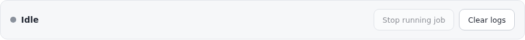
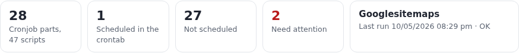
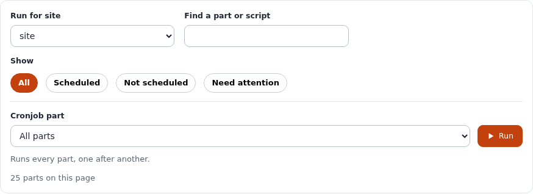
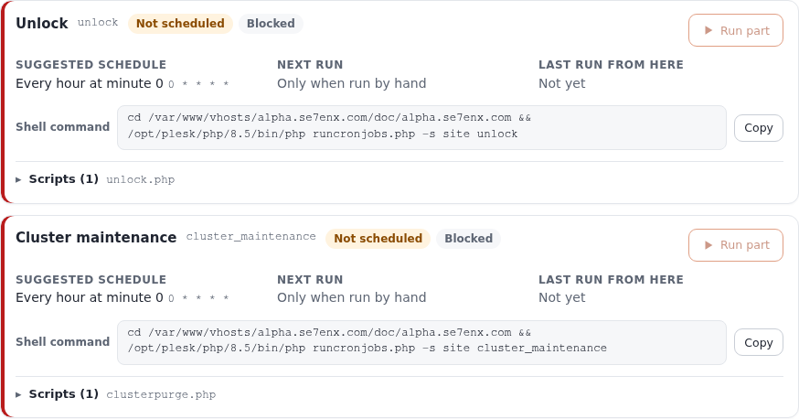
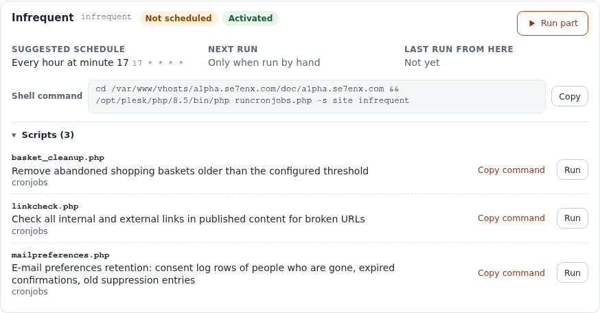
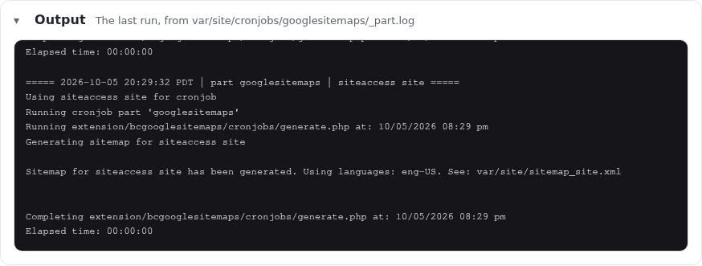
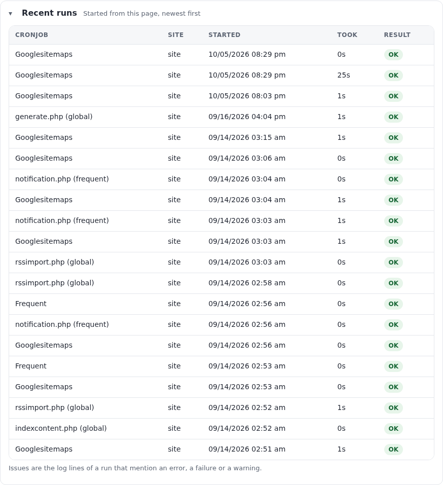
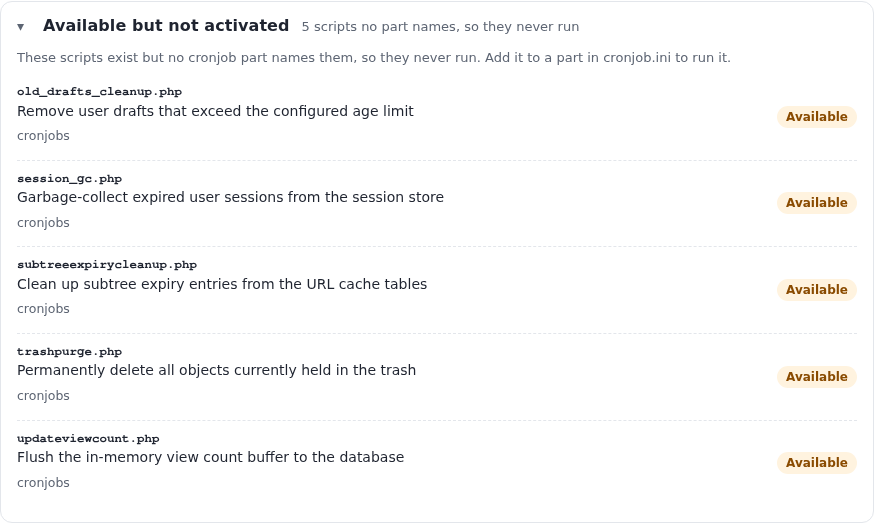

# Cronjobs: running, scheduling and following them

This guide teaches everything about cronjobs in Exponential: what a cronjob part is, how to see every part and
script an installation has, how to run a part or a single script from the administration page **Setup > Cronjobs**
and from a shell, how to follow its output while it works, how to read the schedule of the crontab and install the
lines the page proposes, where the logs are, and what to do when a job does not start, does not finish or is not
scheduled at all.

It is written for administrators who look after a site and for developers who add cronjob scripts. Read sections 1
to 3 first; after that every section stands on its own. Every option, setting and path below was checked against
the code, and every output is real: it was printed on the demonstration server (alpha.se7enx.com) on 5 October
2026, read-only. The screenshots are of the same page, at a width of 1500 pixels in the light mode of the admin4
design; nothing was run, stopped or cleared to make them.

[Guides](README.md) · Feature reference: [Cronjobs console](../features/6.0/cronjobs-console.md) · In the
installation book: [10.3 Cronjobs](../install/10-after-installing.md#103-cronjobs) · Shorter introduction:
[Operating a site, section 3](operating-a-site.md#3-run-cronjobs)

## In short

- A **cronjob part** is a named list of scripts in `settings/cronjob.ini` (`[CronjobPart-<name>] Scripts[]`); the
  scripts of `[CronjobSettings] Scripts[]` form the part the page calls **global**, which `runcronjobs.php` runs when
  it is given no part name.
- **Setup > Cronjobs** (`/setup/cronjobs`, policy `setup/managecronjobs`) shows one card per part: whether the
  crontab runs it, its schedule in words, its next and last run, the shell command that runs it, and its scripts
  with what each one does. **Run part** and **Run** start a part or one script for the site you choose; the output
  follows live in **Output**.
- **Run** beside **Cronjob part** with *All parts* runs every part that may be run, one after another, never two at
  once. **Stop running job** asks the running job to end; **Clear logs** empties the shared output and error logs.
- The page reads the crontab of the user it runs as and recognises the lines that run this installation. For a part
  nothing runs it proposes a line (`CrontabSchedule_<part>` sets its schedule); **Crontab** at the bottom lists them
  ready to paste.
- From a shell: `php runcronjobs.php -s <site> <part>`, `--script=<file>` for one script, `--list` for everything;
  `./console cron:<part>` is the same through the console, `./console crontab:list` and `crontab:edit` show and edit
  the crontab.
- Everything works without JavaScript; with it, runs start in place and the output streams while the job works.

## Contents

- [1. Parts, scripts and the global part](#1-parts-scripts-and-the-global-part)
- [2. Before you start](#2-before-you-start)
- [3. The page at a glance](#3-the-page-at-a-glance)
- [4. The status bar: Stop running job and Clear logs](#4-the-status-bar-stop-running-job-and-clear-logs)
- [5. The overview](#5-the-overview)
- [6. Choosing the site and finding a part](#6-choosing-the-site-and-finding-a-part)
- [7. Running a part, one script, or every part](#7-running-a-part-one-script-or-every-part)
- [8. The part cards](#8-the-part-cards)
- [9. Output: following a job while it runs](#9-output-following-a-job-while-it-runs)
- [10. Recent runs and how issues are counted](#10-recent-runs-and-how-issues-are-counted)
- [11. Scripts no part runs, and activating one](#11-scripts-no-part-runs-and-activating-one)
- [12. Scheduling with the crontab](#12-scheduling-with-the-crontab)
- [13. Running cronjobs from the shell](#13-running-cronjobs-from-the-shell)
- [14. Logs and the files the page keeps](#14-logs-and-the-files-the-page-keeps)
- [15. Without JavaScript, by keyboard and with a screen reader](#15-without-javascript-by-keyboard-and-with-a-screen-reader)
- [16. Workflows, step by step](#16-workflows-step-by-step)
- [17. Troubleshooting](#17-troubleshooting)
- [18. Every setting](#18-every-setting)
- [References](#references)

## 1. Parts, scripts and the global part

A **script** is a PHP file in a cronjob directory: `cronjobs/` of the installation, or `cronjobs/` of an extension
named in `[CronjobSettings] ExtensionDirectories[]`. It does one job: send notifications, purge expired files,
build a sitemap.

A **part** groups scripts that should run together on one schedule:

```ini
# settings/cronjob.ini (shipped)
[CronjobPart-frequent]
Scripts[]=notification.php
Scripts[]=workflow.php
Scripts[]=contentjobs.php
Scripts[]=audit.php
Scripts[]=mailbounces.php
```

`runcronjobs.php frequent` runs these five scripts in that order, in one process. Extensions add parts of their own
in their `settings/cronjob.ini.append.php` (the sitemap parts of `bcgooglesitemaps`, the newsletter parts of
`cjw_newsletter`, the Oracle parts of `ezoracle`).

The scripts of `[CronjobSettings] Scripts[]` are the **default part**. `runcronjobs.php` runs them when it is called
without a part name; the page shows them as a part called **global** (label *Global*), because to an operator that is
what they are. On the demonstration server the global part holds the five kernel scripts plus the sitemap scripts two
extensions append to it.

Every script takes a lock of its own while it runs (`eZMutex`, keyed by the script file), whether it was started as
part of a part, on its own with `--script`, from the crontab or from the page. A second run of the same script while
the first holds the lock prints `Cronjob part locked by other process: <pid>` and skips it. A lock older than
`MaxScriptExecutionTime` is taken over (`Trying to steal the mutex lock`), and one older than twice that is taken over
by force.

## 2. Before you start

**Access.** The page and the stream that follows a job need the policy `setup/managecronjobs` (both views of the
`setup` module check it). Only the Administrator role has it in a new installation. The menu entry is
`Links[cronjobs]=setup/cronjobs` in `settings/menu.ini`, shown to users with `PolicyList_cronjobs[]=setup/managecronjobs`.

**A PHP command line binary.** A job is started as a separate process with PHP's command line binary. The page takes
`cronjob.ini [AdminSettings] PhpCliPath` when it is set, otherwise the first executable of `PHP_BINDIR/php`,
`/usr/bin/php` and `/usr/local/bin/php`. It never uses the binary that answers the web request (under PHP-FPM that is
the FPM binary, which cannot run a script). When none is found the page says so in red at the top and every Run button
is disabled. On a host with several PHP versions set `PhpCliPath` to the one the site runs on, for example
`/opt/plesk/php/8.5/bin/php` on the demonstration server.

**PHP functions.** Starting a job needs `proc_open`; reading the crontab needs `exec`; **Stop running job** needs
`posix_kill`. With one of them in `disable_functions` the page still opens and says which feature is missing.

**The sites.** **Run for site** offers `site.ini [SiteAccessSettings] RelatedSiteAccessList[]`, or
`AvailableSiteAccessList[]` when there is no related list. A job reads the settings of the siteaccess it runs under,
so the choice matters: indexing, sitemaps and notifications act on the content and URLs of that site.

**Where things are written.** The page writes its logs and its records under the var directory of the administration
siteaccess, in `cronjobs/` (on the demonstration server `var/site/cronjobs/`). Section 14 lists every file.

## 3. The page at a glance

From top to bottom:

| Area | What it is for | Section |
|---|---|---|
| Status bar | *Idle*, or what is running, for which site, which process and for how long; **Stop running job**, **Clear logs**; the log file and the PHP binary | 4 |
| Overview | Parts and scripts, scheduled, not scheduled, need attention, the last run and its result | 5 |
| Run and filter | **Run for site**, **Find a part or script**, **Show**, **Cronjob part** with **Run** | 6, 7 |
| Output (folds) | What the running or the last job wrote, following it live | 9 |
| Cronjob parts | One card per part, paged | 8 |
| Available but not activated (folds) | Scripts on disk that no part names | 11 |
| Recent runs (folds, open) | Runs started from this page, newest first | 10 |
| Crontab (folds) | What the crontab holds now, and lines for the parts nothing runs | 12 |

The page is a single form: every button that changes something is a submit button of it, so it works without
JavaScript (section 15). The layout holds from 390 pixels up and at 200 percent zoom; the folding sections are
`<details>` elements, opened and closed with a click or with Enter.

## 4. The status bar: Stop running job and Clear logs



The left side says **Idle**, or **Running: <part>** with a green pulsing dot, followed by **Site: <siteaccess>**,
**Process: <pid>** and **Elapsed: <seconds>s**, which counts up while you watch. The state comes from
`cronjobs/state.json`, written when the page starts a job, and is believed only while that process is alive and its
command line still contains `runcronjobs.php` (a reused process number is not mistaken for the job). Where `/proc` is
not readable, a job is no longer believed to run once it is older than twice `MaxScriptExecutionTime` (shipped 43,200
seconds, so 24 hours).

Only one job started from the page runs at a time. While one runs, every Run button is disabled and a launch is
refused with *The "<part>" part is still running as process <pid>. Wait for it, or stop it first.* Jobs the crontab
starts are not counted: they are separate processes the page does not know about, and the script locks of section 1
keep the two apart.

**Stop running job** sends the job `SIGTERM` (signal 15), not `SIGKILL`: the script can release its lock and end
cleanly. The answer is *Asked process <pid> to stop.*; the Output then shows the end of the job. It is disabled while
nothing runs. It fails with *Process <pid> could not be signalled. It may belong to another user.* when the job runs
as a different system user than the web server answering this request (see section 17).

**Clear logs** empties the shared output log and the error log (`[AdminSettings] LogFile` and `ErrorFile`) and
forgets the last job's state file when nothing is running. It does not delete the per-part logs of section 14 or the
run history. Answer: *Cleared the cronjob output and error logs.*

Below the bar the page names the log the Output shows and the PHP binary jobs run with, so a wrong binary is visible
before anything is run.

## 5. The overview



| Figure | Meaning |
|---|---|
| **Cronjob parts, n scripts** | Every part with at least one script, including *global*; scripts counted per part |
| **Scheduled in the crontab** | Parts a crontab line of this installation runs (section 12) |
| **Not scheduled** | The rest. Not every part has to be scheduled: some are single parts of scripts that `frequent` already runs |
| **Need attention** (red when above 0) | Parts that are blocked (`ForbiddenParts[]`), miss a script, or whose last run from the page logged issues |
| **Last run** | The newest run started from the page, when, and *running*, *OK* or *n issues*; *Nothing has been run from here yet.* before the first one |

On the demonstration server the two parts needing attention are `unlock` and `cluster_maintenance`, which the shipped
settings block (section 7).

## 6. Choosing the site and finding a part



**Run for site** is the siteaccess every Run button on the page uses. It starts on the first site of the list that is
not the administration siteaccess you are looking at, because a job that acts on content should act on the site that
publishes it. Changing it also rewrites the siteaccess in every shell command on the page, so a command you copy
always matches what Run would do.

**Find a part or script** narrows the cards as you type. It matches part names and labels, script file names, and what
the scripts say they do (the `@description` of their header), all words in any order: `sitemap` finds every sitemap
part, `bounce` finds `mailbounces` through its description. While a search is typed, the script lists of the matching parts open,
so a match on a script is visible; they close again when the search is cleared.

**Show** keeps *All* parts, only *Scheduled*, only *Not scheduled*, or only those that *Need attention*. The line
below the controls says how many cards are shown (*25 parts on this page*, or *3 of 25 parts on this page shown*);
*No cronjob part on this page matches.* when the filters leave none.



The search and **Show** act on the cards of the current page. The list is paged by
`admininterface.ini [PaginationSettings] ItemsPerPage[setup/cronjobs]` (shipped 25); the pager is below the list.

## 7. Running a part, one script, or every part

### 7.1 One part

Click **Run part** on the card. Its accessible name is *Run the whole <part> part now*. The page starts
`runcronjobs.php -s <site> --no-colors <part>` (no part name for *global*) as a process of its own that keeps running
after the page is closed, and answers *Started the "<part>" part for <site> as process <pid>.* The status bar turns
to *Running*, the card gets a green edge and the Output opens and follows the job.

### 7.2 One script

Open the card's **Scripts (n)** line and click **Run** beside a script (*Run <script> on its own*). The page starts
`runcronjobs.php -s <site> --no-colors --script=<file>`: only that script, with the same lock and the same output as
when it runs inside its part. Answer: *Started <script> for <site> as process <pid>.* A script that was not found, or
a script of a blocked part, has no Run button but *This script cannot be run from here*.

### 7.3 Every part, one after another

Leave **Cronjob part** on *All parts* and click **Run** beside it. The hint below says *Runs every part, one after
another.* The page collects every part of the list that may be run (on every page of it, not only the cards you see),
writes *Running n parts, one after another.* into the Output, starts the first, and starts the next one 0.4 seconds
after the Output reports the previous one finished (*Next: <part>*). Only one job ever runs at a time.

Choosing a part in **Cronjob part** instead narrows the cards to that part and makes **Run** run it alone (*Runs the
<part> part.*).

The queue lives in the open page: it needs JavaScript and the form token (section 15), and it ends when the page is
closed or reloaded, when **Stop running job** is pressed, or when a start is refused. Parts that are already running
from the crontab are not skipped: their scripts meet the lock and are passed over with *Cronjob part locked by other
process*.

### 7.4 What can be run, and what cannot

A part can be run from the page when all of these hold; otherwise its Run button is disabled:

| Condition | Message when it does not hold |
|---|---|
| The part exists and is not in `[AdminSettings] ForbiddenParts[]` | *No cronjob part named "<part>" can be launched from here.* |
| At least one of its scripts was found (a part with some scripts missing still runs the others) | the same |
| The script belongs to the part (one script) | *The "<part>" part has no script called "<script>".* |
| The site is one of the list | *No siteaccess named "<site>" is served by this installation.* |
| Nothing started from the page is running | *The "<part>" part is still running as process <pid>. Wait for it, or stop it first.* |
| A PHP command line binary was found | *No php command line binary was found. Set cronjob.ini [AdminSettings] PhpCliPath to its full path.* |
| `proc_open` is available | *proc_open is disabled, so a cronjob cannot be started from the interface. Run it from a shell.* |
| `runcronjobs.php` is in the installation root | *runcronjobs.php is not where it should be: <path>* |
| The started process recorded its id within two seconds | *The cronjob was started but did not report its process id, so it cannot be followed or stopped from here. Check <error log>.* |

`ForbiddenParts[]` ships with `cluster_maintenance` (purges cluster storage) and `unlock` (releases locks other
processes hold). Both are destructive and belong to an administrator on a shell, not to a button; their cards say
*Blocked*, and the shell command on the card still shows how to run them.

Every start, stop and clear answers with a redirect back to the page, carrying the message in the session. Reloading
the page afterwards only reads the page again; it can never start a job a second time.

## 8. The part cards



Each card shows, from the top:

- **The name** (the label, *Cache cleanup* for `cache_cleanup`) and the key the shell uses (`cache_cleanup`).
- **Badges.** *Scheduled* (green) when a crontab line of this installation runs the part, *Not scheduled* (amber)
  otherwise. Then *Activated* (green), *Blocked* (grey, in `ForbiddenParts[]`) or *n missing* (red, scripts not found
  in any cronjob directory).
- **The edge.** Red on the left for a part that needs attention, green around the part that is running now.
- **Run part** (section 7.1).
- **Schedule**, or **Suggested schedule** for a part nothing runs: the schedule in words for the common shapes and the
  cron expression beside it. *Every minute*, *Every 5 minutes*, *Every hour at minute 17*, *Every 6 hours at minute
  0* and *Every day at 03:30* are said in words; anything else (`0 8 * * 1-5`) is shown as the expression, which is
  still exact. `@hourly`, `@daily`, `@weekly`, `@monthly`, `@yearly`, `@annually` and `@midnight` are read as their
  five-field equivalents; a line with `@reboot` has no schedule to show (*Not read from the crontab line*).
- **Next run**: when the crontab line runs the part next, in the server's time, computed with the standard cron rules
  (ranges, steps, lists, month and weekday names, Sunday as 0 or 7, day of month and weekday matching either when both
  are restricted). *Only when run by hand* for a part nothing schedules.
- **Last run from here**: when it was last started from the page, how long it took, and *OK* or *n issues*; the
  script's name when one script was run; *Not yet* otherwise. Runs the crontab started are not counted here (their
  output goes wherever the crontab line sends it).
- **Shell command**: the command that runs the part now, from the installation root, with the PHP binary of the
  page and the site chosen above, for example
  `cd /var/www/vhosts/alpha.se7enx.com/doc/alpha.se7enx.com && /opt/plesk/php/8.5/bin/php runcronjobs.php -s site infrequent`.
  **Copy** puts it on the clipboard (*The command is on the clipboard.*). Unlike a crontab line it does not send the
  output to `/dev/null`, so whoever pastes it sees what the job says.
- **Scripts (n)**, folded to one line of names. Opened, each script with what it does (the `@description` tag of its
  header, or of the class file its entry point names), the directory it was found in (*not found in any cronjob
  directory* in red when missing), **Copy command** (the `--script=` command for that script alone) and **Run**.

## 9. Output: following a job while it runs



**Output** shows the end of the log of the newest run started from the page (the last 64 KB; *... earlier output not
shown ...* above when there is more), followed by anything new in the error log. Its summary names the file:
*The last run, from var/site/cronjobs/googlesitemaps/_part.log*. It is open while a job runs and opens by itself when
the page starts one.

Every run starts with a header line the page writes:

```
===== 2026-10-05 20:29:32 PDT | part googlesitemaps | siteaccess site =====
Using siteaccess site for cronjob
Running cronjob part 'googlesitemaps'
Running extension/bcgooglesitemaps/cronjobs/generate.php at: 10/05/2026 08:29 pm
Generating sitemap for siteaccess site

Sitemap for siteaccess site has been generated. Using languages: eng-US. See: var/site/sitemap_site.xml

Completing extension/bcgooglesitemaps/cronjobs/generate.php at: 10/05/2026 08:29 pm
Elapsed time: 00:00:00
```

With JavaScript, while a job runs, the page follows its log through a server-sent event stream
(`/setup/cronjobsstream`), starting where the printed log ended, so nothing is printed twice. Header lines are blue,
error log lines red. The line beside the heading says *following…*, then *finished* when the job has ended and its last
output was read (two seconds after the process is gone), or *stream closed* when the connection broke. When the queue
of section 7.3 starts the next part, the stream switches to that part's log by itself (*Following
<part>/_part.log.*). A stream ends after an hour (*Stopped following after an hour. The cronjob is still running;
reopen the page to follow it again.*); the job is not affected, only the following.

The stream is opened only while something runs: with nothing running the page already shows the log, and a stream
would hold a PHP worker for nothing.

## 10. Recent runs and how issues are counted



**Recent runs** lists the last 20 runs started from the page, newest first: the part, or *script (part)*; the site;
when it started; how long it took; and *running*, *OK* or *n issues*. The page records a run when it starts it,
because the job outlives the request; a run that is no longer alive is settled on the next page view, its duration
taken from when its log was last written.

**Issues** are the lines of that run's part of its log (everything after its own `=====` header) that contain one of
the words *error*, *fatal*, *exception*, *failed*, *failure* or *warning*. It is a pointer, not a verdict: a script that
prints "0 errors" counts one issue. Open the log (section 14) to see what the lines say.

`[AdminSettings] HistoryLength` (default 100) is how many runs `cronjobs/history.json` keeps; the cards' **Last run
from here** looks at those, the table shows the newest 20.

Each run of a cronjob part is also recorded in the audit trail as `system.cronjob.run` (or `system.cronjob.fail`),
whoever started it: see the [audit trail](../features/6.0/audit-trail.md).

## 11. Scripts no part runs, and activating one



**Available but not activated** lists every `*.php` in the cronjob directories that no part names, with what it does
and where it is. Nothing ever runs them. In a new installation these are, among others, `session_gc.php` (expired
sessions), `old_drafts_cleanup.php`, `trashpurge.php` (empties the trash: only if you mean it),
`staticcache_cleanup.php`, `subtreeexpirycleanup.php` and `updateviewcount.php`.

To run one once, use the shell (section 13) with `--script=<file>`. To run it regularly, add it to a part: to an
existing one, or to a part of its own so it gets its own schedule:

```ini
# settings/override/cronjob.ini.append.php
[CronjobPart-sessions]
Scripts[]=session_gc.php
```

Clear the INI cache (`php bin/php/ezcache.php --clear-tag=ini --allow-root-user`), reload the page: the card
*Sessions* appears, *Not scheduled*, with a suggested schedule of every hour at minute 0. Section 12 schedules it.

A script of your own goes in `cronjobs/` of your extension, with the extension named in
`[CronjobSettings] ExtensionDirectories[]`. Give its header a `@description` line; the page, the search and
`./console list cron` show it:

```php
<?php
/**
 * @description Remove expired entries from the example table
 */
```

## 12. Scheduling with the crontab

### 12.1 What the page reads

The page runs `crontab -l` as the system user the web server runs as, and counts a line as running a part of this
installation when it contains `runcronjobs.php` and the installation root's real path. The part is the first word
after `runcronjobs.php` that is not an option (`-s` and `--siteaccess` take the next word with them); no such word
means the global part. Lines of other installations on the same machine are ignored.

The **Crontab** section at the bottom shows what is in the crontab now (*In the crontab now*, read from `crontab -l`),
or, when there is none, *The user this site runs as (<user>) has no crontab, or crontab is not on the path. The entries
below would be added to it.*

### 12.2 What the page proposes

**Suggested entries** holds one line for every part that is neither scheduled nor blocked, written from this
installation's own root and PHP binary, for the site chosen when the page was drawn:

```
17 * * * * cd /var/www/vhosts/alpha.se7enx.com/doc/alpha.se7enx.com && /opt/plesk/php/8.5/bin/php runcronjobs.php -s site infrequent >/dev/null 2>&1
```

**Copy the suggested entries** copies them all. Nothing adds them for you. The schedule of each line is
`[AdminSettings] CrontabSchedule_<part>` when it is set, otherwise `*/5 * * * *` for `frequent`, `*/15 * * * *` for
the global part, `17 * * * *` for `infrequent` and `0 * * * *` for every other part:

```ini
# settings/override/cronjob.ini.append.php
[AdminSettings]
CrontabSchedule_sessions=50 3 * * *
CrontabSchedule_cache_cleanup=40 3 * * *
```

### 12.3 Installing the lines

1. Decide which parts to schedule. `frequent` every few minutes is what notifications and content jobs expect;
   `infrequent` and the global part hourly; cleanup parts once a night. A single part such as `notification` only
   needs a line of its own when it should run more often than `frequent`, which already contains its script.
2. Copy the lines from **Suggested entries**, or the card's shell command with a schedule in front.
3. Open the crontab of the site user (the one the web server runs as, so the files the jobs write belong to it):
   `crontab -e -u <site user>`, or `./console crontab:edit` as that user. Paste, save.
4. Reload the page. The parts are *Scheduled*, the cards show the schedule in words and the next run.

Prefer `>/dev/null 2>&1`, as the page writes it, or a log of your own after the part name:

```
*/5 * * * * cd /path/to/installation && php runcronjobs.php -q -s site frequent >> var/log/cron-frequent.log 2>&1
```

For the global part, which has no part name, end the line with `>/dev/null 2>&1`: the page takes the first word after
the options as the part name, so `>> var/log/cron-default.log` there would be read as a part called `>>` and the
global part would show as not scheduled (section 17).

The real crontab of the demonstration server's root user holds one line of this installation:

```
* * * * * cd /var/www/vhosts/alpha.se7enx.com/doc/alpha.se7enx.com && /opt/plesk/php/8.5/bin/php runcronjobs.php -q publishing >> var/log/cronjob-publishing.log 2>&1 # exponential static cache and search index after publishing (sevenx_alpha_settings)
```

The page reads it as the part `publishing`, *Every minute*.

## 13. Running cronjobs from the shell

Run every command from the installation root. As `root`, add `--allow-root-user`; better, run as the site user, so
the files a job writes stay writable for the web server.

### 13.1 runcronjobs.php

```bash
php runcronjobs.php --help --allow-root-user
```

```
Usage: runcronjobs.php [OPTION]... [PART]
Executes Exponential cronjobs.

General options:
  -h,--help          display this help and exit 
  -q,--quiet         do not give any output except when errors occur
  -s,--siteaccess    selected siteaccess for operations, if not specified default siteaccess is used
  -d,--debug         display debug output at end of execution
  -c,--colors        display output using ANSI colors
  --sql              display sql queries (must be used in conjunction with debug option)
  --logfiles         create log files
  --no-logfiles      do not create log files (default)
  --list             list all cronjobs parts and the scripts contained by each one
  --script=<file>    run one named script instead of a whole part, for instance
                     --script=notification.php. The file is looked for in the
                     directories cronjob.ini names; only its file name is used
  --no-colors        do not use ANSI coloring (default)
```

The common calls:

```bash
php runcronjobs.php --list --allow-root-user                              # every part and its scripts
php runcronjobs.php -s site frequent --allow-root-user                    # one part
php runcronjobs.php -s site --script=notification.php --allow-root-user   # one script
php runcronjobs.php -s site --allow-root-user                             # the global part
```

`--siteaccess site` and `--siteaccess=site` both work, as do `--script notification.php` and
`--script=notification.php`. Only the file name of `--script` is used, so a path cannot reach a script outside the
cronjob directories. `--list` prints each script once for every cronjob directory it is found in; on the demonstration
server `ScriptDirectories[]` names `cronjobs` three times (the kernel and two settings files append it), so each kernel
script appears three times:

```
CronjobPart-frequent:
		 cronjobs/notification.php
		 cronjobs/notification.php
		 cronjobs/notification.php
		 cronjobs/workflow.php
		 ...
```

### 13.2 The console

Every `[CronjobPart-...]` of the kernel and of the extensions is also a console command, `cron:<part>`, described by
the `@description` tags of its scripts:

```bash
./console list cron
```

```
cron       — cronjobs/*.php  (Cronjob parts via runcronjobs.php)
──────────────────────────────────────────────────────────────────
  cron:archivesitemap                        Generate the archive XML sitemaps of the configured siteaccesses
  cron:audit                                 Audit: sink spools, alert rules, rotation by day, archives, retention and checkpoints
  cron:cache_cleanup                         Remove expired and old view cache and cache-block files from disk (+1 more)
  ...
  cron:frequent                              Process and dispatch pending notification events to subscribers (+4 more)
  ...
```

`./console cron:frequent -s site --allow-root-user` runs `runcronjobs.php` with the options you give and the part
name last. `./console help cron:frequent` lists every script's description. The global part has no `cron:` command;
run it with `runcronjobs.php` and no part. `./console crontab:list` prints the crontab of the current user and
`./console crontab:edit` opens it in `$EDITOR`.

### 13.3 The command from the page

The **Shell command** of a card and **Copy command** of a script are the exact commands the page would run, with the
PHP binary and the root it uses (section 8). Paste one into a terminal when you want to see a job's output in your own
shell, or run it under a debugger (`-d` adds the debug output at the end).

## 14. Logs and the files the page keeps

All paths are below the var directory of the administration siteaccess (`var/site/` on the demonstration server):

| File | Written by | Holds |
|---|---|---|
| `cronjobs/<part>/_part.log` | each run of a whole part from the page | the header line and everything the part printed, appended run after run |
| `cronjobs/<part>/<script>.log` | each run of one script from the page | the same for that script, for example `cronjobs/frequent/notification.log` |
| `cronjobs/error.log` (`ErrorFile`) | every run from the page | what the processes wrote to standard error |
| `cronjobs/output.log` (`LogFile`) | older versions of the page | the shared log; shown in Output only before the first run of this version |
| `cronjobs/history.json` | each start from the page | the runs: part, script, site, pid, start, end, issues, log (at most `HistoryLength`) |
| `cronjobs/state.json` | each start from the page | the job running now (or that ran last): pid, part, script, site, start, log |
| `cronjobs/run.pid` | each start from the page | the process id the job writes for itself before it starts PHP |

Runs started by the crontab write wherever their line redirects them (`>> var/log/cron-frequent.log 2>&1`, or
nowhere with `>/dev/null`). The page does not read those files. Rotate the per-part logs and your crontab logs with the
system's logrotate ([10.10 Logs and log rotation](../install/10-after-installing.md#1010-logs-and-log-rotation));
the page reads only the last 64 KB of a log and the last 256 KB to count issues, so a large log costs nothing on the
page, only disk space.

## 15. Without JavaScript, by keyboard and with a screen reader

**Without JavaScript** the page keeps its whole function. **Run part**, **Run**, **Stop running job** and **Clear
logs** submit the form; the page comes back with the message and the new state. The Output shows the log as it was when
the page was drawn: reload to see more. The folding sections are `<details>` and open without script. Hidden without
JavaScript, because they need it: **Find a part or script**, **Show**, **Cronjob part** with **Run** (the queue of all
parts), the count line, and the Copy buttons (the commands stay on the page to select by hand).

**With JavaScript** the same buttons send their request in the background, with the form token (`ezformtoken`) in the
body and in an `X-CSRF-Token` header, and the page updates itself without a reload. When the page has no token to
send, or the browser has no `EventSource`, the buttons fall back to submitting the form, and the queue of all parts is
hidden.

**Keyboard.** Every control is a native button, select, input or summary, in reading order, with a visible focus ring.

**Screen readers.** Every control has a label; every Run button names its part or script (*Run the whole Infrequent
part now*, *Run notification.php on its own*); messages are in `role="status"` or `role="alert"` regions and the
status bar is `aria-live`, so a start, a stop and the end of a job are announced. The Output is a focusable region
with a label.

**Contrast and size.** Text has at least 4.5:1 contrast in the light and the dark mode of admin4; the page holds from
390 pixels up and at 200 percent zoom. The same template serves the older admin design, taking admin4's colours where
they exist. The page's texts are translated in `ger-DE`.

## 16. Workflows, step by step

### 16.1 Try a new script before scheduling it

1. Put the script in `cronjobs/` of your extension, with a `@description`, and name it in a part (section 11).
2. Clear the INI cache and open **Setup > Cronjobs**. Type part of its name into **Find a part or script**: the card
   appears with the script and its description.
3. Choose the site, open **Scripts**, click **Run** beside the script. Watch **Output**.
4. *OK* in **Recent runs**: schedule the part (section 12.3). *n issues*: read the log, fix, run again.

### 16.2 Find out why something did not happen overnight

1. **Show: Need attention.** A blocked part or a missing script shows here first.
2. On the part's card: *Scheduled*? If not, nothing runs it (section 12). If so, **Next run** says when it runs next;
   a past time cannot appear, so a schedule that is never due shows *—*.
3. The crontab's own log (the file its line redirects to) says what the scheduled run printed; the page's logs only
   hold runs started from the page.
4. Run the part from the page for the same site and read **Output**.

### 16.3 Schedule a part of its own

1. Add `[CronjobPart-<name>]` (section 11) and, if the hourly default does not fit,
   `CrontabSchedule_<name>=<schedule>` in `[AdminSettings]`.
2. Clear the INI cache, reload the page, check the card's **Suggested schedule** in words.
3. **Crontab > Copy the suggested entries**, keep the new line, install it (section 12.3).
4. Reload: the card is *Scheduled* with its next run.

### 16.4 Run everything once, after an import or a restore

1. Choose the site, leave **Cronjob part** on *All parts*, click **Run**.
2. The Output says *Running n parts, one after another.* and *Next: <part>* between them. Leave the page open: the
   queue lives in it.
3. When the last part has finished, check **Recent runs** for *n issues*.

## 17. Troubleshooting

| Symptom | Cause | Fix |
|---|---|---|
| Red message *No php command line binary could be found*; every Run disabled | None of `PhpCliPath`, `PHP_BINDIR/php`, `/usr/bin/php`, `/usr/local/bin/php` is an executable file | Set `cronjob.ini [AdminSettings] PhpCliPath` to the CLI binary of the PHP version the site uses |
| *proc_open is disabled, so a cronjob cannot be started from the interface* | `proc_open` in `disable_functions` | Allow it for the site's PHP pool, or run from a shell (section 13) |
| *The cronjob was started but did not report its process id* | The shell or PHP could not start (wrong binary, unreadable root, `nohup` missing), or `cronjobs/` is not writable | Read the error log named in the message; check the binary below the status bar; check that the var directory is writable by the web server user |
| A card's Run part is disabled while nothing runs | The part is blocked, all its scripts are missing, or there is no PHP binary | The badges say which: *Blocked* (`ForbiddenParts[]`), *n missing*; run blocked parts from a shell |
| Every Run is disabled and the status bar says *Running* for hours | A job really runs that long, or the state file names a process that is still a `runcronjobs.php` | Look at the process (`ps -p <pid> -o pid,etime,cmd`); **Stop running job**; a stale state clears itself after twice `MaxScriptExecutionTime` where `/proc` is not readable |
| *Process <pid> could not be signalled. It may belong to another user.* | The job was started through one web server (for example Velocity, running as root) and the stop is asked through another (Apache with PHP-FPM, running as the site user) | Stop it from the server that started it, or `kill -TERM <pid>` as its owner |
| A run from the page logs *Cronjob part locked by other process: <pid>* and does nothing | The crontab (or another shell) runs the same script right now | Wait for it; this is the lock of section 1 working |
| Jobs started from the page write files the scheduled jobs cannot change (or the other way round) | The page and the crontab run as different system users | Run the crontab as the user the web server runs as; start jobs from the server that runs as that user |
| A part the crontab runs shows *Not scheduled* | The line does not contain this installation's real root path (a symlinked path), or it belongs to another user's crontab than the web server's | Use `cd <real root> &&` in the line, as the suggested entries do; install it in the crontab of the user the web server runs as (the page reads only that one) |
| The global part shows *Not scheduled* although a line runs it | The line ends with a redirection to a log (`>> var/log/x.log`), which the page reads as the part name | End the global part's line with `>/dev/null 2>&1`, or give its output a log through a wrapper script |
| Apache and Velocity show different *Scheduled* figures | Each reads the crontab of the user it runs as (`crontab -l`) | Expected; schedule in the site user's crontab and judge by the server that runs as that user |
| **Output** still shows the old run after **Clear logs** | Clear logs empties the shared output and error logs; the Output shows the newest run's own log | Expected. Delete or rotate `cronjobs/<part>/*.log` if they should go |
| Output says *stream closed* and nothing more arrives | The connection broke (a proxy timeout, a restart of the web server); the job is unaffected | Reload the page; it picks the job up from its state. A queue of all parts is lost with the reload: start the remaining parts by hand |
| Output stays empty behind nginx while a job runs | A proxy buffers the event stream | The stream sends `X-Accel-Buffering: no`; set `proxy_buffering off` for `/setup/cronjobsstream` on other proxies |
| *n issues* for a run that worked | A line with *error*, *warning*, *failed* ... in normal output ("0 errors") | Read the lines; they are pointers, not verdicts |
| **Next run** shows *—* for a scheduled part | The schedule never comes round (31 February) or cannot be read | Correct the crontab line; `scheduleOfLine()` reads five fields or an `@` macro |
| A new part does not appear | INI cache | `php bin/php/ezcache.php --clear-tag=ini --allow-root-user`, then reload |
| *No siteaccess named "<site>" is served by this installation.* | The site was removed from `RelatedSiteAccessList[]` after the page was drawn | Reload the page and choose again |
| The page answers *Access denied* | The user lacks `setup/managecronjobs` | Give the role the policy `setup` / `managecronjobs` |

## 18. Every setting

| File | Block | Setting | Default | What it does |
|---|---|---|---|---|
| `cronjob.ini` | `CronjobSettings` | `ScriptDirectories[]` | `cronjobs` | Directories searched for scripts, relative to the root |
| `cronjob.ini` | `CronjobSettings` | `ExtensionDirectories[]` | empty | Extensions whose `cronjobs/` directory is searched too |
| `cronjob.ini` | `CronjobSettings` | `Scripts[]` | `unpublish.php`, `rssimport.php`, `indexcontent.php`, `hide.php`, `internal_drafts_cleanup.php` | The global part |
| `cronjob.ini` | `CronjobSettings` | `MaxScriptExecutionTime` | `43200` | Seconds after which a script's lock may be taken over (twice: by force); twice it also ends the page's belief that a job runs, where `/proc` is not readable |
| `cronjob.ini` | `CronjobPart-<name>` | `Scripts[]` | `frequent`, `infrequent`, `contentjobs`, `audit`, `notification`, `mailpreferences`, `mailbounces`, `unlock`, `cluster_maintenance`, `cleanuprss`, `cache_cleanup` | The scripts of a part |
| `cronjob.ini` | `AdminSettings` | `ForbiddenParts[]` | `cluster_maintenance`, `unlock` | Parts the page will not start |
| `cronjob.ini` | `AdminSettings` | `PhpCliPath` | empty (searched) | The PHP command line binary for runs from the page and in the commands it shows |
| `cronjob.ini` | `AdminSettings` | `LogFile` | `cronjobs/output.log` | The shared output log, relative to the var directory |
| `cronjob.ini` | `AdminSettings` | `ErrorFile` | `cronjobs/error.log` | The error log of runs from the page |
| `cronjob.ini` | `AdminSettings` | `HistoryLength` | `100` (not in the shipped file) | Runs kept in `cronjobs/history.json`; values below 1 mean 100 |
| `cronjob.ini` | `AdminSettings` | `CrontabSchedule_<part>` | `*/5 * * * *` frequent, `*/15 * * * *` global, `17 * * * *` infrequent, `0 * * * *` others (not in the shipped file) | The schedule of the suggested crontab line for a part |
| `site.ini` | `SiteAccessSettings` | `RelatedSiteAccessList[]`, else `AvailableSiteAccessList[]` | | The sites under **Run for site** |
| `admininterface.ini` | `PaginationSettings` | `ItemsPerPage[setup/cronjobs]` | `25` | Part cards per page |
| `menu.ini` | `Leftmenu_setup` | `Links[cronjobs]`, `LinkNames[cronjobs]`, `PolicyList_cronjobs[]` | `setup/cronjobs`, `Cronjobs`, `setup/managecronjobs` | The menu entry and who sees it |

Change them with [exp:ini](../features/6.0/exp-ini-command.md), for example
`./console exp:ini set cronjob.ini/AdminSettings/PhpCliPath /opt/plesk/php/8.5/bin/php global` (the scope `global`
writes `settings/override`), and clear the INI cache afterwards. `./console exp:ini list cronjob.ini/AdminSettings` shows what is in effect:

```
[AdminSettings]
ForbiddenParts[]=cluster_maintenance
ForbiddenParts[]=unlock
PhpCliPath=
LogFile=cronjobs/output.log
ErrorFile=cronjobs/error.log
4 variables in [AdminSettings] of cronjob.ini in effect
```

## References

- Feature page: [Cronjobs console](../features/6.0/cronjobs-console.md)
- Installation book: [10.3 Cronjobs](../install/10-after-installing.md#103-cronjobs) (the shipped parts and scripts, a
  complete crontab), [10.10 Logs and log rotation](../install/10-after-installing.md#1010-logs-and-log-rotation)
- Guides: [Operating a site](operating-a-site.md#3-run-cronjobs),
  [Notifications: running them and fixing problems](notifications-administrator.md),
  [E-mail preferences: setting them up and running them](mail-preferences-administrator.md)
- The console: [Exponential Console](../bc/6.0/console.md#cronjob-parts-and-the-crontab-added-june-2026)
- For developers: [Commands, cronjob parts and module views as classes](../bc/6.0/cli_cronjob_view_abstractions.md),
  [the specification](../specifications/6.0/runnable-commands-cronjobs-views.md)
- Related features: [Content jobs](../features/6.0/content-jobs.md), [Velocity scheduler](../features/6.0/velocity-scheduler.md),
  [Audit trail](../features/6.0/audit-trail.md), [Maintenance mode](../features/6.0/maintenance-mode.md),
  [page sizes](../bc/6.0/pagination-settings.md)
- Code: `kernel/setup/expcronjobrunner.php` (parts, launching, history, crontab, schedules),
  `kernel/private/classes/views/setup/cronjobs.php` and `cronjobsstream.php` (the views),
  `kernel/private/classes/commands/runcronjobs.php` (`runcronjobs.php`), `kernel/classes/ezruncronjobs.php` (the script
  lock), `design/admin4/templates/setup/cronjobs.tpl` (the page; the same file in `design/admin`)
- Tests: `tests/tests/kernel/classes/expCronjobRunnerScheduleTest.php` (schedules in words, next runs, commands,
  descriptions)
