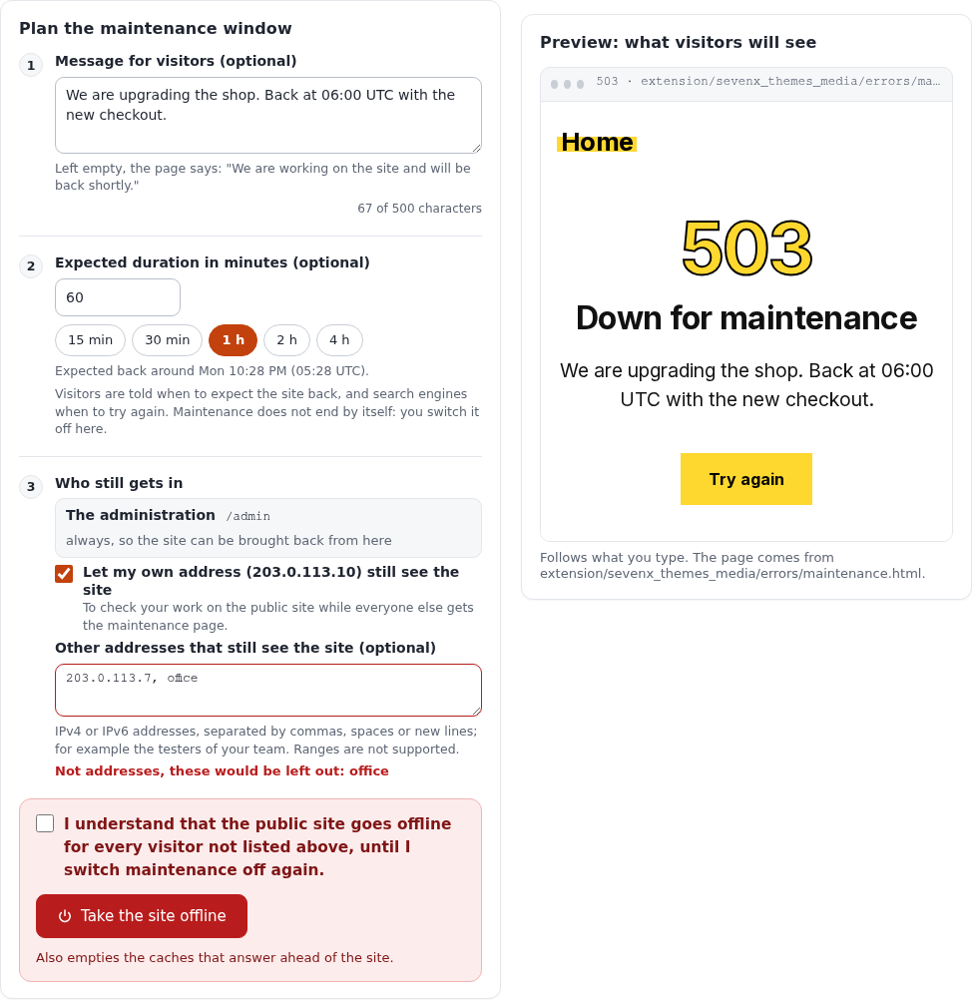
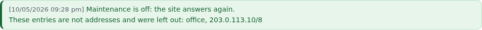
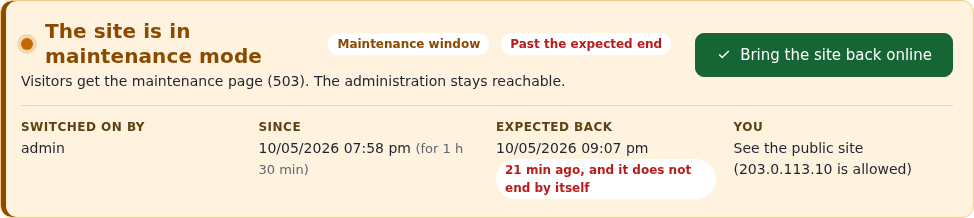
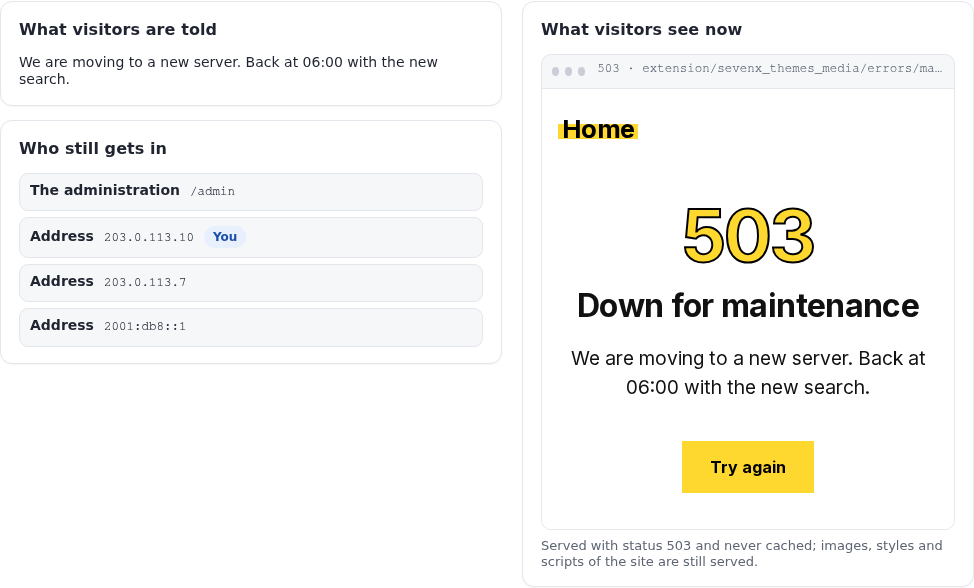
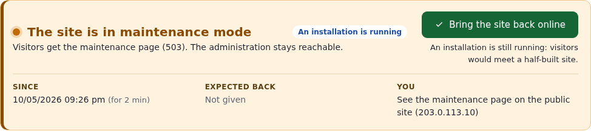
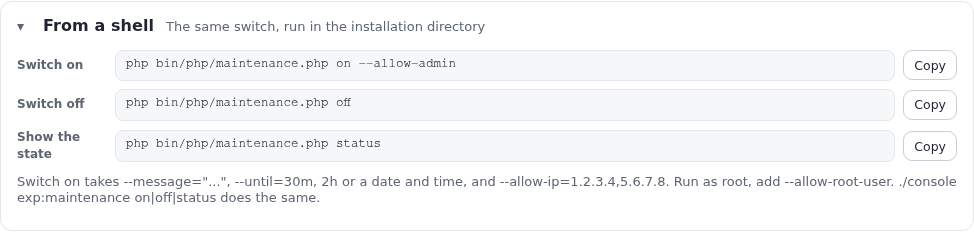
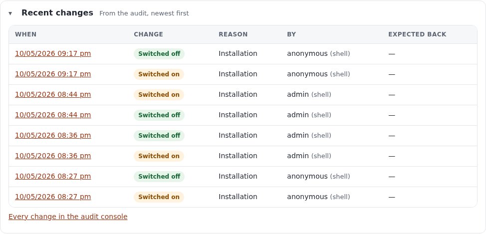

# Maintenance mode: taking the site offline and bringing it back

This guide teaches everything about maintenance mode in Exponential: what visitors, administrators and allowed
addresses get while it is on, how to switch it on and off from the administration page **Setup > Maintenance** and
from a shell, how to write the message, give the expected end and decide who still gets in, how to preview the page
visitors will see, how it works together with Velocity, Apache, the caches, cronjobs, the kickstarter and deploys,
what the state file `var/maintenance.json` holds, and how to get back in when something went wrong.

It is written for administrators who run upgrades, imports and repairs on a live site. Read sections 1 to 3 first;
after that every section stands on its own. Every option, field and path below was checked against the code
(`kernel/classes/expmaintenance.php`, `kernel/private/classes/views/setup/maintenance.php`,
`kernel/private/classes/commands/maintenance.php`, the front controllers). The outputs are real: printed on the
demonstration server (alpha.se7enx.com) on 5 October 2026 by the commands shown, read-only. The screenshots are of
the same page in the light mode of the admin4 design; the "in maintenance" pictures were rendered from the page's
template with a sample state, because the demonstration site was never taken offline to make this guide. The
viewer's address in them is the documentation address 203.0.113.10.

[Guides](README.md) · Feature reference: [Maintenance mode](../features/6.0/maintenance-mode.md) · In the
installation book: [Maintenance windows](../install/10-after-installing.md#maintenance-windows) ·
Related guide: [Cronjobs](cronjobs.md)

## In short

- **Setup > Maintenance** (`/setup/maintenance`) takes the public site offline: every page request gets a
  maintenance page with status `503 Service Unavailable`, `Retry-After` and `no-store`. Images, styles and scripts
  are still served. The administration under `/admin` stays reachable, so the same page brings the site back.
- The form asks for an optional **message**, an optional **expected duration** (one click for 15 minutes to 4 hours),
  and **who still gets in**: your own address with one tick, other addresses in a list. A **preview** shows the real
  page with your message as you type. A required **confirmation** guards the button **Take the site offline**.
- While the site is offline the page leads with an amber banner: why, by whom, since when, until when, whether the
  expected end has passed, and whether **you** see the site or the maintenance page. **Bring the site back online**
  ends it. Maintenance never ends by itself when the expected time passes.
- From a shell: `php bin/php/maintenance.php on --message="..." --until=2h --allow-admin`, `... off`,
  `... status`, or the same through `./console exp:maintenance`. Without `--allow-admin` the administration is
  offline too.
- The whole state is one file, `var/maintenance.json`. While it exists, `index.php`, `index_rest.php` and
  `index_treemenu.php` answer with the maintenance page before the settings or the database are touched. Deleting
  the file ends maintenance: that is the way back in when nothing else works (section 15).
- Every switch on and off is written to the audit (`system.maintenance.change`); the page lists the latest eight.

## Contents

- [1. What maintenance mode does](#1-what-maintenance-mode-does)
- [2. Before you start](#2-before-you-start)
- [3. The page at a glance](#3-the-page-at-a-glance)
- [4. Taking the site offline from the page](#4-taking-the-site-offline-from-the-page)
- [5. While the site is offline](#5-while-the-site-is-offline)
- [6. From the command line](#6-from-the-command-line)
- [7. Who still gets in](#7-who-still-gets-in)
- [8. The maintenance page and its preview](#8-the-maintenance-page-and-its-preview)
- [9. Apache, Velocity and the caches](#9-apache-velocity-and-the-caches)
- [10. Installations, cronjobs and deploys](#10-installations-cronjobs-and-deploys)
- [11. The state file var/maintenance.json](#11-the-state-file-varmaintenancejson)
- [12. Settings and permissions](#12-settings-and-permissions)
- [13. Recent changes and the audit](#13-recent-changes-and-the-audit)
- [14. Workflows, step by step](#14-workflows-step-by-step)
- [15. Troubleshooting](#15-troubleshooting)
- [16. Every option and field](#16-every-option-and-field)
- [References](#references)

## 1. What maintenance mode does

Maintenance mode answers every page request with one self-contained HTML page instead of the site. It exists for
two situations:

- **A window you open on purpose**: an upgrade, a data import, a repair of the content tree, a database migration.
  Visitors get a clear message instead of errors or half-changed pages.
- **An installation**: the kickstarter and the web setup wizard rebuild the database while the web server keeps
  answering. Without maintenance mode, requests in that time met half-built tables and wrote errors into the logs
  that were not the installation's. Both switch it on and off by themselves (section 10).

What each kind of request gets while it is on:

| Request | Answer |
|---|---|
| A page of the public site (`/`, `/Fit-Healthy`, `/content/search`) | The maintenance page, status 503 |
| The REST API (`index_rest.php`) and the admin tree menu (`index_treemenu.php`) | The maintenance page, status 503 |
| A path below an allowed prefix (`/admin/...` when the administration is kept open) | The site, as usual |
| A request from an allowed address | The site, as usual |
| The browser of a running web setup wizard (cookie `exp_setup_wizard`) | The site, as usual |
| An image, a stylesheet, a script, a font, `favicon.ico` | Served as usual: they are files, not page requests |
| A command or a cronjob in a shell | Runs as usual: maintenance concerns web requests only |

The maintenance page is sent with these headers, by `expMaintenance::send()`:

```text
HTTP/1.1 503 Service Unavailable
Retry-After: <seconds until the expected end, or 120 when none is given>
Cache-Control: no-store, no-cache, must-revalidate, private
Pragma: no-cache
Expires: 0
Content-Type: text/html; charset=utf-8
X-Robots-Tag: noindex
```

A 503 with `Retry-After` is the answer search engines understand as "come back later": the pages keep their place in
the index. `no-store` keeps every cache, proxy and browser from holding on to the maintenance page after the window.

The check runs first thing in the front controller, before `autoload.php`, the settings and the database
(`index.php`, lines 21 to 29):

```php
if ( is_file( __DIR__ . '/var/maintenance.json' ) )
{
    require_once __DIR__ . '/kernel/classes/expmaintenance.php';
    if ( expMaintenance::check( __DIR__ ) )
        return;
}
```

So the maintenance page needs nothing that may be broken during the window: no template, no INI file, no database
connection. While the file does not exist, the cost is one `is_file()` call per request.

## 2. Before you start

- **The right**: the page needs the policy `setup / administrate`, the same as the other Setup pages. The Setup menu
  shows **Maintenance** only to users who hold it (`menu.ini`, `PolicyList_maintenance[]=setup/administrate`).
- **The address of the administration**: the page keeps paths below `/admin` reachable. That is the administration
  when it is reached as `https://www.example.com/admin/...`, the usual set-up. An administration reached by a host
  name of its own (`https://edit.example.com/setup/maintenance`) or under another path
  (`/admintest_admin4/...`) is **not** below `/admin`: switching maintenance on from there locks that address out.
  Use the `/admin` address, or keep your own address allowed (section 7), or have a shell ready (section 6).
- **A shell, just in case**: for a planned window, keep a terminal open in the installation directory. Section 15
  shows the one command that ends maintenance whatever else is wrong.
- **Who is affected**: everyone who reaches a front controller of this installation, through every web server that
  serves it. On alpha that is Apache on ports 80 and 443 and Velocity on 8080; the state file is shared, so both go
  offline and come back together.

## 3. The page at a glance

Open **Setup > Maintenance**. The page is built in the same way in every state, top to bottom:

1. **The state**, in a banner: green **The site is online**, or amber **The site is in maintenance mode** with its
   facts and the button that ends it.
2. **The plan** (online) or **what visitors are told and who still gets in** (offline), with the **preview** of the
   maintenance page beside it on a wide screen and below it on a narrow one.
3. **From a shell**: the commands that do the same, with Copy buttons.
4. **Recent changes**: the latest switches from the audit.
5. **How it works**: what is served and where the state is kept.

When the site is online the banner says so and promises that nothing changes until you confirm:


The page works without JavaScript: both buttons submit the form, the confirmation is a required checkbox the browser
checks itself, and the folding sections are plain `<details>` elements. With JavaScript, the duration presets, the
"expected back" line, the character counter, the address check, the live preview and the Copy buttons are added.
The page holds from a phone at 390 pixels to a wide screen and at 200 % zoom; its text has a contrast of at least
4.5:1 in the light and the dark mode of admin4.

## 4. Taking the site offline from the page

The form has three numbered steps, a preview and a confirmation. Every step is optional except the confirmation.



### Step 1: the message for visitors

Up to 500 characters (field `MaintenanceMessage`). It replaces the page's default text, which for a window is
"We are working on the site and will be back shortly." Say what is happening and when the site is back in words a
visitor understands: "We are upgrading the shop. Back at 06:00 UTC with the new checkout." The counter below the
field shows how much room is left. The text is escaped when it is put into the page, so HTML in it is shown as text.

### Step 2: the expected duration

Minutes, from 1 to 10080 (a week; field `MaintenanceMinutes`). The buttons **15 min**, **30 min**, **1 h**, **2 h**
and **4 h** fill the field in one click, and the line below says when that is in your time and in UTC ("Expected back
around Mon 10:28 PM (05:28 UTC)."). The page stores the end as a time (`until`, section 11). It is used three ways:

- the maintenance page says "Expected back at 05:28 UTC." (when the theme's page has the `{until}` placeholder);
- the `Retry-After` header carries the seconds left, so search engines and clients come back at the right time;
- the administration page counts down to it, and warns when it has passed.

The expected end is a promise to visitors, not a timer: **maintenance does not end by itself** when it passes. Leave
the field empty when you do not know; the page then says "Please try again in a few minutes." and `Retry-After` is
120 seconds.

### Step 3: who still gets in

- **The administration** (`/admin`) always stays reachable from this page; there is no setting for it.
- **Let my own address (…) still see the site** (`MaintenanceAllowMe`) adds the address your request comes from. Tick
  it when you want to check your work on the public site while everyone else gets the maintenance page. Leave it
  unticked when you want to see the maintenance page yourself, to be sure it is on.
- **Other addresses** (`MaintenanceAllowIPs`): IPv4 or IPv6 addresses, separated by commas, spaces, semicolons or new
  lines. Ranges and networks (`10.0.0.0/8`) are not supported: each address is compared exactly. The page checks
  what you type and names what is not an address ("Not addresses, these would be left out: office"); the server
  checks again, leaves such entries out and says which ones after switching on:



Section 7 explains every way through in detail.

### The preview

Beside the form is the maintenance page itself, as it will be sent: the active theme's page, filled in. With
JavaScript it follows the message and the duration as you type. It is shown in a frame that runs none of the page's
scripts, so its buttons do nothing there. The line under it names the file the page comes from (section 8).

### The confirmation and the button

Tick **I understand that the public site goes offline for every visitor not listed above, until I switch maintenance
off again.** and press **Take the site offline**. The browser refuses to send the form without the tick, with or
without JavaScript. The form carries the administration's form token, like every form of the administration.

Switching on writes `var/maintenance.json` (section 11), moves the HTTP cache's files aside so no page stored before
the window is served during it, and records the change in the audit. The page answers "Maintenance is on: visitors
see the maintenance page." and shows the offline state.

## 5. While the site is offline



The banner tells you:

| Fact | Where it comes from |
|---|---|
| **Maintenance window**, **An installation is running**, **Setup wizard running** or **Unreadable marker** | The marker's `reason` (section 11) |
| **Past the expected end** and "21 min ago, and it does not end by itself" | `until` is in the past and the marker is still there |
| **Switched on by** | The login that pressed the button (`by`; not set for a window opened in a shell) |
| **Since** and how long ago | `since` |
| **Expected back** and how long is left | `until`; "Not given" when none was set |
| **Ends unless the wizard is used again** | `lease`, for the web setup wizard only |
| **You** | Whether your address is on the list: "See the public site" or "See the maintenance page on the public site" |

Below it, **What visitors are told** shows the message (or that the default text is used), **Who still gets in**
lists the open paths and the allowed addresses (yours is marked **You**), and **What visitors see now** is the page
being served, from the file named in the marker.



**Bring the site back online** (`SwitchOffButton`) removes the marker, moves the HTTP cache's files aside again so
changes made during the window show at once, and records the change in the audit. It needs no confirmation: bringing
the site back is always safe, with one exception the page warns about.



When an installation holds maintenance ("An installation is still running: visitors would meet a half-built site."),
wait for it to finish: the kickstarter and the wizard switch it off themselves. Ending it early lets visitors see a
half-built site.

To change the message or the end of a window that is already open, switch it off and on again with the new values,
or run `bin/php/maintenance.php on` again in a shell: switching on while it is on replaces the marker (and resets
`since`).

## 6. From the command line

Everything the page does is also a command. Run it in the installation directory; as root add `--allow-root-user`
(the script refuses otherwise).

```bash
php bin/php/maintenance.php on --message="Back at 06:00" --until=2h --allow-admin
php bin/php/maintenance.php status
php bin/php/maintenance.php off
./console exp:maintenance on|off|status       # the same command, through the console
```

The page's **From a shell** section lists the three commands with Copy buttons:



The options, from `php bin/php/maintenance.php --help` on alpha:

```text
Usage: bin/php/maintenance.php [OPTION]... [ACTION]
Maintenance mode: take the site offline and back

  maintenance.php on|off|status [options]
...
Options:
  --message=VALUE   What the page says, instead of the default text
  --until=VALUE     When the site is expected back: 30m, 2h, or a date and time
  --allow-ip=VALUE  Addresses that still see the site, comma separated
  --allow-admin     Keep the administration (/admin) reachable
```

What differs from the page:

| | The page | The command |
|---|---|---|
| The administration | Always kept open (`/admin`) | Only with `--allow-admin`; **without it `/admin` is offline too** |
| Expected end | Minutes, at most a week | `--until=30m`, `--until=2h`, or any date and time PHP's `strtotime()` reads (`"2026-09-28 06:00"`, in the server's time zone) |
| Addresses | Checked; what is not an address is left out and named | `--allow-ip` is split at commas and trimmed, not checked: a typo is stored and simply never matches |
| Your own address | One tick | Name it in `--allow-ip` |
| `by` in the marker | Your login | Not set |
| A wrong `--until` | Cannot happen | `--until: "..." is not a time (30m, 2h, or a date and time)`, exit code 1 |

`status` prints the state. With maintenance off, as on alpha while this guide was written:

```text
$ php bin/php/maintenance.php status --allow-root-user
Maintenance is off.
```

With it on, `status` prints `Maintenance is ON (<reason>[, setup run <id>])` and then the lines `since`, `until`,
`message`, `allowed` (the addresses), `open` (the paths) and `page`, each only when set.

`off` when maintenance was not on prints "Maintenance was not on." and exits 0, so it is safe in scripts.

## 7. Who still gets in

`expMaintenance::letThrough()` decides, for each request, in this order:

1. **The web setup wizard's browser**: the cookie `exp_setup_wizard`, whose SHA-256 hash the marker holds as
   `allow_token`. Only the wizard sets it.
2. **An allowed address**: the request's `REMOTE_ADDR` is exactly one of `allow_ips`.
3. **An allowed path**: the path is one of `allow_paths` or below it. The page always sets `/admin`; the command
   with `--allow-admin`.

Everything else gets the maintenance page. Here is the function's real answer for a window with
`allow_ips` 203.0.113.7 and 203.0.113.10 and `allow_paths` `/admin`, with `REMOTE_ADDR` and `REQUEST_URI` set
for each line (run through `bin/php/ezexec.php`, with nothing switched):

```text
198.51.100.20   /                            the maintenance page (503)
198.51.100.20   /admin/setup/maintenance     the site
198.51.100.20   /administration              the maintenance page (503)
203.0.113.7     /                            the site
198.51.100.20   /setup/maintenance           the maintenance page (503)
```

Things to know:

- **A prefix is a whole path segment.** `/admin` lets `/admin` and `/admin/...` through, not `/administration` and
  not `/admintest_admin4/...`.
- **The address is the one PHP sees.** Behind a proxy or a load balancer `REMOTE_ADDR` is the proxy's address unless
  the web server restores the client's (Apache `mod_remoteip`, nginx `real_ip`). Allow the address the server logs,
  not the one a "what is my IP" site shows, when the two differ. The page's "Let my own address" uses the
  administration's own idea of your address (`eZSys::clientIP()`), which is what is stored.
- **There is no allow-list by user.** Being logged in does not let anyone through on the public site: maintenance is
  decided before the session is read. Give testers access by their address, or let them look through the
  administration's preview.
- **Being let through means the full site**, with its caches. An allowed visitor may see pages stored before the
  window (section 9).

## 8. The maintenance page and its preview

The page visitors get is a self-contained HTML file with placeholders:

- the first active extension's `errors/maintenance.html` (found when maintenance is switched on, and stored in the
  marker as `page`); on alpha that is `extension/sevenx_themes_media/errors/maintenance.html`;
- otherwise the kernel's `share/maintenance.html`.

`expMaintenance::page()` fills these placeholders:

| Placeholder | Filled with |
|---|---|
| `{status}` | `503` |
| `{title}` | "Down for maintenance" for a window, "The site is being set up" for an installation |
| `{message}` | The message, or the default text: "We are working on the site and will be back shortly." (installation: "It is being installed right now and will be here in a few minutes.") |
| `{until}` | "Expected back at HH:MM UTC." while the expected end is in the future, else "Please try again in a few minutes." |
| `{home}` | `/` |
| `{reference}`, `{detail}` | Empty |

Every value is HTML-escaped. The real result for the window of section 11, with the kernel's page:

```text
<title>Down for maintenance</title>
<h1>Down for maintenance</h1>
<p class="message">We are upgrading the shop. Back at 03:00 UTC with the new checkout.</p>
<p class="reference">Please try again in a few minutes.</p>
```

(The window's end, 28 September 2026 03:00 UTC, was already in the past when this was printed, hence "Please try
again".)

To make the page your own, give your theme extension an `errors/maintenance.html`:

- keep it self-contained: inline CSS, or stylesheets and fonts as static files under a path the web server serves
  directly (they are not page requests, so they are served during maintenance);
- use no template code, no PHP and nothing from the database: none of it is available;
- links to the site go to the maintenance page too, so offer at most "Try again";
- switch maintenance on again after adding or moving the file: the marker remembers the file it was given.

The page's **preview** is the same `expMaintenance::page()` result in a sandboxed frame, with the page's scripts
taken out; the live preview replaces the message and the end as you type. What you see in it is what is sent.

## 9. Apache, Velocity and the caches

**Apache with PHP-FPM** runs `index.php` for every page request, so the check applies directly. Static files are
served by Apache without PHP and stay available.

**Velocity** sends page requests to the same front controllers (`index.php`, `index_rest.php`,
`index_treemenu.php`), so the check applies there too. Its own response cache would otherwise answer before PHP; the
generated site configuration names the marker as the cache's **pause file** (`Q.web.cache.pauseFile`, written by
`kernel/classes/expvelocity.php`). While `var/maintenance.json` exists, neither Velocity's cache nor the
application's HTTP cache answers; every request reaches `index.php` and gets the maintenance page. A worker looks at
the file at most twice a second. This needs Velocity 0.0.4.34 or later. Velocity's warm-up also skips its work while
maintenance is on (`kernel/private/classes/commands/velocity-warmup.php`).

**The caches in front of PHP**:

- Switching on and off moves the HTTP cache's directories (`var/<site>/cache/exphttpcache`) aside to
  `var/tmp/<site>-exphttpcache-before-maintenance-<time>-<pid>`, instead of deleting them. They can be removed later.
- Velocity's response cache is cleared by `./console exp:velocity cache clear` when maintenance is switched on or
  off by the command, or by the page when Velocity serves the administration. When Apache serves the administration
  page, run it yourself after switching off, so a change made during the window is seen at once:

  ```bash
  ./console exp:velocity cache clear --allow-root-user
  ```

- A CDN or reverse proxy in front of the site does not store the maintenance page (`no-store`), but it may still
  hold pages from before the window. Purge it when the window changed content.

## 10. Installations, cronjobs and deploys

**The kickstarter** (`php bin/php/kickstarter.php run`) switches maintenance on for its run with reason `setup` and
its run id, and off at the end when the site is installed and checked. If maintenance is **already on** when it
starts, it keeps that window exactly as it is (`expMaintenance::beginRun()` returns `existing`) and leaves it on
afterwards; it prints "Maintenance mode was already on: kept as it is, and left on after the installation (php
bin/php/maintenance.php off ends it)." After a failed step it leaves maintenance on, so a half-installed site is not
shown. The page shows such a run as **An installation is running**, with no path open: the administration is
offline during a kickstarter run too.

**The web setup wizard** switches it on at its first request with reason `setup`, a 30-minute lease and a cookie for
its own browser. Each wizard request renews the lease; a wizard that is left alone stops holding maintenance after
30 minutes without anyone deleting anything. Its last page switches maintenance off.

**Cronjobs** run in a shell and are not affected: `runcronjobs.php` and the parts started from **Setup > Cronjobs**
keep running during a window. Stop the crontab yourself when a job must not run while you change the site (an
import, a search index rebuild over a half-migrated database). See [Cronjobs](cronjobs.md).

**Deploys** (`./console exp:velocity deploy`) do not switch maintenance on or off. For a deploy that changes the
database or many files at once, open a window first and close it after the smoke test (section 14).

## 11. The state file var/maintenance.json

Maintenance is on exactly while `var/maintenance.json` exists (with one exception: a web wizard's marker whose lease
has run out counts as off). It is written whole to a temporary file and renamed into place, so a request never reads
half of it, with mode 0666 so both the web server's user and the shell's can replace it.

The marker the page would write for a one-hour window opened at 02:00 UTC, with two allowed addresses, encoded
exactly as `expMaintenance::enable()` encodes it, with its defaults (printed through `bin/php/ezexec.php` without
calling `enable()`, so nothing was written):

```json
{
    "reason": "manual",
    "message": "We are upgrading the shop. Back at 03:00 UTC with the new checkout.",
    "until": 1790564400,
    "allow_ips": [
        "203.0.113.7",
        "203.0.113.10"
    ],
    "allow_paths": [
        "/admin"
    ],
    "by": "admin",
    "page": "extension/sevenx_themes_media/errors/maintenance.html",
    "since": 1790560800
}
```

| Field | Written by | Meaning |
|---|---|---|
| `reason` | all | `manual` (a window), `setup` (kickstarter or web wizard). A marker that is not valid JSON counts as on with reason `unknown`. |
| `message` | page, command | The visitors' message; empty for the default text. |
| `until` | page, command | Expected end, Unix time; `0` for none. Shown on the page, sent as `Retry-After`. Never ends maintenance. |
| `allow_ips` | page, command | Addresses let through, compared exactly. |
| `allow_paths` | page (`/admin`), command (`--allow-admin`) | Path prefixes let through. |
| `by` | page | Login of the user who switched it on. |
| `page` | `enable()` | The page file, relative to the installation; empty for `share/maintenance.html`. |
| `since` | `enable()` | When it was switched on, Unix time. |
| `run` | kickstarter, wizard | The setup run's id; a run switches off only a marker carrying its own id. |
| `lease` | wizard | Unix time after which the marker no longer counts. |
| `allow_token` | wizard | SHA-256 hash of the wizard browser's cookie. |

A marker that cannot be read still means maintenance: a maintenance page is better than a site half way through a
change. Edit the file by hand only to end maintenance (delete it); to change a window, switch it on again.

## 12. Settings and permissions

Maintenance mode has no INI settings of its own: it must work before the settings are read. What there is:

| Where | What |
|---|---|
| `kernel/setup/module.php` | The view `setup/maintenance`, function `administrate`, actions `SwitchOnButton` and `SwitchOffButton` |
| `settings/menu.ini` | `Links[maintenance]=setup/maintenance`, `LinkNames[maintenance]=Maintenance`, `PolicyList_maintenance[]=setup/administrate` (the Setup menu entry) |
| Roles | `setup / administrate` to use the page; `audit / read` (channel `system`) to see **Recent changes** |
| Velocity site configuration | `Q.web.cache.pauseFile` = the installation's `var/maintenance.json`, generated by `exp:velocity` |
| The audit | Event `system.maintenance.change`, channel `system`, severity `notice`, on by default (`kernel/classes/audit/expaudittaxonomy.php`) |
| Theme | `extension/<theme>/errors/maintenance.html`, optional (section 8) |

The limits of the page are constants of the view class: at most 10080 minutes, presets 15, 30, 60, 120 and 240
minutes, eight changes listed, a message of at most 500 characters.

## 13. Recent changes and the audit

Every switch on, change and switch off is recorded in the audit as `system.maintenance.change`, with the mode
before and after, the reason, the expected end, and the **number** of allowed paths and addresses (never the
addresses themselves). The page lists the latest eight, newest first, from the audit's index:



- **When** links to the full audit record (`/audit/event/<id>`).
- **Change** is **Switched on**, **Switched off** or **Changed** (switched on while already on).
- **By** is the login; "(shell)" marks a change made from the command line, a cronjob or a test run.
- **Every change in the audit console** opens the console filtered to these events
  (`/audit/console/(name)/system.maintenance.change`).

The list needs `audit / read` for the `system` channel and the audit index. Without them the section says so
instead ("Reading the changes needs the audit/read right for the system channel.", "The audit index is not
available, ..."). The index is filled by the `frequent` cronjob group, so a change can take a few minutes to appear;
see [Audit trail](../features/6.0/audit-trail.md).

## 14. Workflows, step by step

### A planned upgrade

1. A day before: tell your users, and check you have a shell on the server and a backup
   ([10.9 Backups and restore](../install/10-after-installing.md#109-backups-and-restore)).
2. Open **Setup > Maintenance** at the `/admin` address. Message: "We are upgrading the site. Back at 06:00 UTC."
   Duration: **2 h**. Tick **Let my own address still see the site**. Check the preview. Confirm and **Take the site
   offline**.
3. In a private window or from your phone (another address), open the site: you get the maintenance page. With
   `curl -sI https://www.example.com/ | head -1` you see `HTTP/1.1 503 Service Unavailable`.
4. Do the upgrade. Check the public site from your own browser: you see the real site.
5. **Bring the site back online**. Clear Velocity's cache when Apache serves the administration (section 9).
6. Check that the site answers 200 for everyone: `curl -s -o /dev/null -w '%{http_code}\n' https://www.example.com/`.

### An emergency

Something is breaking pages in front of visitors and you need a minute to look:

```bash
php bin/php/maintenance.php on --message="We are fixing a problem. Back shortly." --allow-admin --allow-ip=<your address>
```

Fix, check from your address, then `php bin/php/maintenance.php off`. The page in the administration shows the same
window and can end it as well.

### Partial access for testers

Testers must see the new site before everyone else:

1. Collect their addresses (the ones your web server logs for them).
2. Open the window with those addresses in **Other addresses that still see the site**, one per line.
3. They browse the full site; everyone else gets the maintenance page. **Who still gets in** lists them while the
   window is open.

### Safety checklist

Before switching on:

- [ ] You are on the `/admin` address, or your address is allowed, or you have a shell.
- [ ] The message says when the site is back, in visitors' words.
- [ ] Cronjobs that must not run during the window are stopped.
- [ ] The preview shows the right page.

Before switching off:

- [ ] No installation is running (the banner would say so).
- [ ] The site works from an allowed address.

After switching off:

- [ ] `curl` gets 200 for the front page, through every server (Apache and Velocity).
- [ ] `var/maintenance.json` is gone: `ls var/maintenance.json` answers "No such file or directory".
- [ ] Caches in front of the site are cleared when content changed.

## 15. Troubleshooting

| Symptom | Cause | Fix |
|---|---|---|
| After switching on, the administration itself shows the maintenance page | The administration is not under `/admin` (its own host name, or a path such as `/admintest_admin4`), or maintenance was switched on in a shell without `--allow-admin` | In a shell, in the installation directory: `php bin/php/maintenance.php off`. If PHP cannot run: `rm var/maintenance.json`. Then use the `/admin` address. |
| Locked out and no PHP on the command line | Any | Delete the marker: `rm /path/to/installation/var/maintenance.json`. That is all maintenance is. |
| "I switched it on but the site still shows normally" | Your address is allowed (you ticked "Let my own address"); or you look through a CDN that still holds the page | Check **You** in the banner; look from another network or with `curl -sI`. |
| The site is still offline long after the expected end | The expected end is not a timer | Switch it off on the page or with `off`. The banner shows **Past the expected end**. |
| An allowed tester still gets the maintenance page | Their address is not the one PHP sees (proxy, IPv6 instead of IPv4, a changed address), or it was mistyped in `--allow-ip` | Look up the address in the web server's access log; switch on again with it. The page's address check names entries that are not addresses. |
| "Maintenance could not be switched on: var/maintenance.json is not writable." | `var/` is not writable by the web server's user, or a marker owned by another user cannot be replaced | Make `var/` writable for the web server's user; check the owner of an existing marker. |
| The site comes back but shows old pages | A cache in front of PHP kept pages from before the window | `./console exp:velocity cache clear --allow-root-user`; purge the CDN; see section 9. |
| The banner says **Unreadable marker** | `var/maintenance.json` is not valid JSON (edited by hand, disk full while writing) | Switch off, then on again with the values you want. |
| The banner says **An installation is running** and nothing is installing | A kickstarter run stopped after a failed step and left maintenance on on purpose | Read the setup log, finish or repair the installation, then `php bin/php/maintenance.php off`. |
| **Setup wizard running** after the wizard was closed | The wizard's lease (30 minutes after its last request) has not run out | Wait for the lease shown in the banner, or switch off. |
| The REST API answers 503 | The API is a front controller too | Allow the API clients' addresses, or keep the window short. |
| Cronjobs failed during the window | They kept running against a site being changed | Stop the crontab for the window (section 10); run the parts again from **Setup > Cronjobs** afterwards. |
| **Recent changes** says the audit index is not available | The audit index tables are missing or the `frequent` cronjob does not run | See [Audit trail](../features/6.0/audit-trail.md); the console lists the events from the files meanwhile. |
| The preview frame stays empty | The browser blocks `srcdoc` frames, or the theme's page is not valid HTML | Open the theme's `errors/maintenance.html` in a browser directly. |

## 16. Every option and field

**The page** (`POST /setup/maintenance`, form `maintenanceform`):

| Field | Meaning |
|---|---|
| `MaintenanceMessage` | Message for visitors, at most 500 characters |
| `MaintenanceMinutes` | Expected duration in minutes, 0 or empty for none, at most 10080 |
| `MaintenanceAllowMe` | Present: the requester's address is added to `allow_ips` |
| `MaintenanceAllowIPs` | Addresses, separated by commas, spaces, semicolons or new lines; what is not an IPv4 or IPv6 address is left out and named |
| `SwitchOnButton` | Switches on (reason `manual`, `allow_paths` `/admin`, `by` the login) |
| `SwitchOffButton` | Switches off and clears the HTTP cache |

**The command** `php bin/php/maintenance.php <action> [options]` or `./console exp:maintenance <action> [options]`:

| Action or option | Meaning |
|---|---|
| `on` | Switch on (or replace the window) |
| `off` | Switch off; "Maintenance was not on." when it was not |
| `status` | Print the state (the default action) |
| `--message=TEXT` | The visitors' message |
| `--until=30m`, `--until=2h`, `--until="2026-09-28 06:00"` | Expected end |
| `--allow-ip=A,B` | Addresses let through, comma separated, not checked |
| `--allow-admin` | Keep `/admin` reachable |
| `--allow-root-user` | Needed when run as root |

## References

- [Maintenance mode](../features/6.0/maintenance-mode.md): the feature reference.
- [Maintenance windows](../install/10-after-installing.md#maintenance-windows): the short entry in the
  installation book.
- [Cronjobs](cronjobs.md): stopping and running jobs around a window.
- [Audit trail](../features/6.0/audit-trail.md): the console, the index, the `system` channel.
- [Velocity: running Exponential in a persistent-worker web server](../features/6.0/velocity-persistent-worker-server.md):
  the response cache and its pause file.
- [Kickstarter](../features/6.0/kickstarter-cli.md) and the [setup wizard](../features/6.0/setup-wizard-and-editor-siteaccess.md):
  installations that hold maintenance by themselves.
- [Deploying](deploying.md): shipping a change.
- Code: `kernel/classes/expmaintenance.php` (the check, the marker, the page, the caches),
  `kernel/private/classes/views/setup/maintenance.php` (the page), `design/admin4/templates/setup/maintenance.tpl`
  (and its copy in `design/admin`), `kernel/private/classes/commands/maintenance.php` (the command),
  `share/maintenance.html`, `index.php`, `index_rest.php`, `index_treemenu.php`; tests in
  `tests/tests/kernel/classes/setup/MaintenancePageTest.php` and `MaintenanceRunTest.php`.
- RFC 9110, section 15.6.4 (503 Service Unavailable) and section 10.2.3 (Retry-After).
