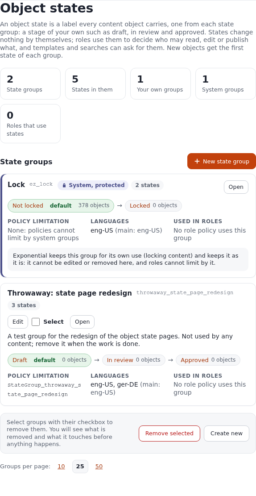
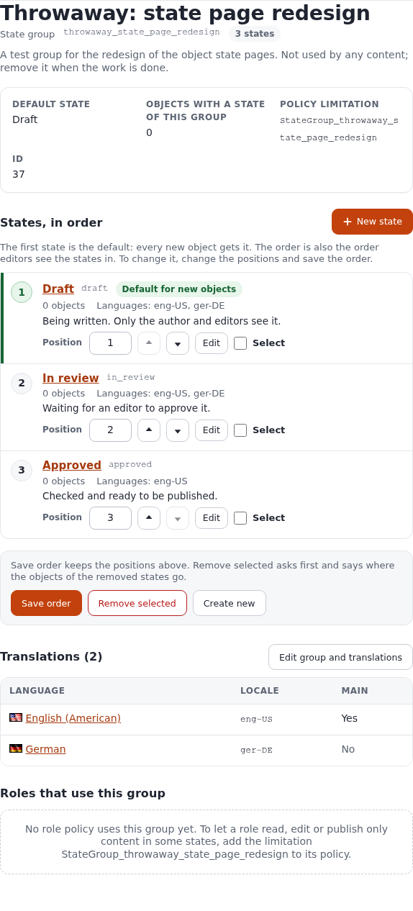
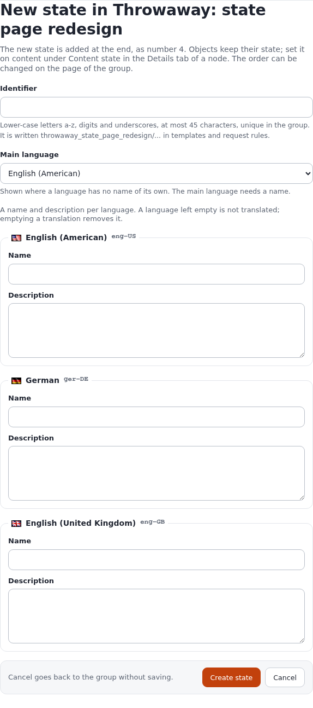

# Object states: stages of your own for content, and who may do what in each

This guide teaches everything about content object states in Exponential: what they are for, how state groups and
states relate, how to create, translate, order and remove them in the administration, how content gets a state and
how you change it (in the browser, for a whole subtree, from a shell and over the remote services), and how roles,
templates, request rules and workflows use them. It ends with a worked review workflow (draft, in review, approved)
and the problems people run into.

It is written for administrators who set up an editorial process and for site builders who show or hide content by
its state. Read sections 1 and 2 first; after that every section stands on its own. Every page, field, setting and
command below was checked against the code of Exponential 6.0 on 5 October 2026; the screens are those of the admin4
design, and the older admin design shows the same page.

[Guides](README.md) · Depth: [Roles and policies in order](../features/6.0/role-policy-order.md),
[Large operations as content jobs](../features/6.0/content-jobs.md),
[Backend services: object states](../bc/6.0/backend_ezjscore_services.md#object-states-expstate-23-services-9-writes)

## In short

- An **object state** is a label every content object carries, one from each **state group**. Exponential ships one
  group, `ez_lock` (Not locked, Locked); you add your own, for example a group `review` with Draft, In review and
  Approved.
- States change nothing by themselves. **Roles** make them matter: a policy limited by `StateGroup_review` applies
  only to objects in the chosen states, and the `NewState` limitation of `state/assign` says which states a user
  may set.
- The **first state** of a group is its default: every new object gets it, and the first state you create in a new
  group is given to every object that exists.
- Groups and states live under **Setup > States** (`/state/groups`). Removing asks first and says what it touches:
  objects of a removed state move to the first state that stays.
- Set states on one object in the node's **Details** tab (Content state), on a whole subtree with "Also for everything
  below this node" (a content job when it is large), from a shell or a remote client with the `expstate` services.
- Groups whose identifier starts with `ez` belong to Exponential: they cannot be edited or removed, and policies
  cannot limit by them.

## Contents

- [1. What object states are for](#1-what-object-states-are-for)
- [2. Groups, states and the default state](#2-groups-states-and-the-default-state)
- [3. The pages under Setup, States](#3-the-pages-under-setup-states)
- [4. Creating a group and its states](#4-creating-a-group-and-its-states)
- [5. The order, and changing the default](#5-the-order-and-changing-the-default)
- [6. Translations](#6-translations)
- [7. Setting states on content](#7-setting-states-on-content)
- [8. States in roles and policies](#8-states-in-roles-and-policies)
- [9. A worked example: a review workflow](#9-a-worked-example-a-review-workflow)
- [10. States in templates, fetches and request rules](#10-states-in-templates-fetches-and-request-rules)
- [11. The system lock group ez_lock](#11-the-system-lock-group-ez_lock)
- [12. Workflows, events, audit and search](#12-workflows-events-audit-and-search)
- [13. Removing states and groups](#13-removing-states-and-groups)
- [14. Troubleshooting](#14-troubleshooting)
- [15. Reference](#15-reference)
- [References](#references)

## 1. What object states are for

Sections say *where* content belongs (the standard section, media, users), and the content tree says *what it sits
under*. States say *how far along* content is, or any other property that changes over its life and that you want
roles to respect: a review stage, a legal clearance, an embargo, a "featured" flag.

| You want | With states |
|---|---|
| Authors write freely, but only approved content is public | A group `review`; the anonymous role reads only `Approved` |
| Reviewers, not authors, decide when something is approved | `state/assign` for reviewers may set `Approved`; for authors only `In review` |
| Authors stop editing once a text is in review | `content/edit` for authors limited to the state `Draft` |
| A list of "what is waiting for review" | A fetch filtered on the state `In review` |
| A notice on pages that are still drafts | A template test on the object's `state_identifier_array` |

What states do not do: they do not hide content by themselves, they do not version content (setting a state makes no
new version), and they do not move content. All of that comes from the roles, templates and fetches that ask for them.

## 2. Groups, states and the default state

A **state group** is a question with a fixed set of answers; its **states** are the answers. Every object has
exactly one state in every group:

```
group "review"   ->  Draft (default) -> In review -> Approved
group "ez_lock"  ->  Not locked (default) -> Locked
```

| Term | Means | Stored in |
|---|---|---|
| State group | A set of states; identifier, a name and description per language, a main language | `ezcobj_state_group`, `ezcobj_state_group_language` |
| State | One answer: identifier unique in its group, a name and description per language, a priority (its place in the order) | `ezcobj_state`, `ezcobj_state_language` |
| An object's state | One row per object and group | `ezcobj_state_link` |
| Default state | The state with priority 0, the first in the order | (the order) |
| Policy limitation | `StateGroup_<group identifier>`, offered by the content and state functions | `ezpolicy_limitation` |

Three rules follow from the code and explain most of what you will see:

1. **New objects get the default of every group.** When a draft object is created, Exponential links it to the
   state with priority 0 of each group (`eZContentObject::assignDefaultStates()`).
2. **The first state of a new group is given to everything.** When a group gets its first state, every object that
   exists is linked to it in the same transaction. A group without states does nothing.
3. **Groups starting with `ez` are the system's.** `ez_lock` and any other `ez...` group cannot be edited, gain or
   lose states, or be removed from the pages, and they are never offered as a policy limitation. New groups cannot
   use the prefix: the identifier check refuses it.

## 3. The pages under Setup, States

Open **Setup > States**, or go to `/state/groups`. You need the policy `state/administrate`.



The page has:

- **An explanation** of what states are, in one paragraph.
- **Five figures**: state groups, the states in them, your own groups, system groups, and how many roles use states in
  their policies.
- **One card per group**: its name and identifier, `System, protected` for `ez...` groups, the number of states, and
  "Used by N roles" when policies name it. Below that its states in order as a chain, with `default` on the first and
  the number of objects in each; the policy limitation (`StateGroup_<identifier>`, or "None" for a system group), the
  languages with the main one, and the roles whose policies use it, each with the policies (`content/read`,
  `state/assign` ...) and a link to the role.
- **Edit** and **Select** on your own groups, **Open** on every group.
- **Remove selected** and **Create new** at the bottom, and the page size (10, 25, 50; from `admininterface.ini
  [PaginationSettings]`) with the page navigator when there are more groups than fit.

Opening a group (`/state/group/<identifier>`) shows:



- The group's description, its default state, how many objects have a state of it, the policy limitation and its ID.
- **States, in order**: each state with its position number, its identifier, "Default for new objects" on the first,
  its objects, its languages and its description; a **Position** field, **Move up** and **Move down** (with
  JavaScript), **Edit** and **Select**.
- **Save order**, **Remove selected** and **Create new**.
- **Translations** of the group, each linking to the group shown in that language (`/state/group/<identifier>/<locale>`),
  and **Edit group and translations**.
- **Roles that use this group**: per role its policies and how it uses the group ("Applies only to objects in some
  states" for `StateGroup_...`, "Lets users set some states" for `NewState`), or, when none does, the limitation to
  add.

A state's own page (`/state/view/<group>/<state>`) shows its objects, its position ("1 of 3"), identifier and ID, the
chain of its group with the state marked, its translations and the roles whose policies name it, with **Edit** and
**Back to the group**.

Every page works without JavaScript: selecting is a checkbox, every action a button, a confirmation is a page of its
own. With JavaScript, Move up and Move down renumber the positions on the page and a screen reader hears where the
state went.

## 4. Creating a group and its states

The example builds the group `review` used in section 9.

1. **Setup > States > New state group** (or **Create new** at the bottom). The form is `/state/group_edit`.
2. **Identifier**: `review`. Lower-case letters a-z, digits and underscores, at most 45 characters, unique; it may not
   start with `ez`. Templates, request rules and searches use it, and policies name the group `StateGroup_review`.
3. **Name and description per language**: one fieldset per language of the installation. Fill in at least the main
   language; a language left empty is not translated. Name: `Review`; description: `How far an article is in the
   editorial review.`
4. **Main language** (only with more than one language): the language shown where another has no name. It must have
   a name.
5. **Create**. You land on the new group, which has no states yet.



Now the states, in the order you want them:

1. On the group's page, **New state** (`/state/edit/review`). The page says which number the state gets.
2. Identifier `draft`, name `Draft`, description `Being written. Only the author and editors see it.` **Create
   state**. Being the first state, it is given to every object that exists, and it becomes the default.
3. Again: `in_review`, `In review`, `Waiting for an editor to approve it.`
4. Again: `approved`, `Approved`, `Checked and ready to be published.`

The group's card on `/state/groups` now reads `Draft (default) -> In review -> Approved` with the number of objects in
each: everything in Draft.

If the kernel refuses the form, the page lists why, for example `Identifier: invalid, it can only consist of
characters in the range a-z, 0-9 and underscore.`, `Identifier: identifiers starting with "ez" are reserved.`, a name
longer than 45 characters, or `Translations: you need to add at least one localization`. Correct it and save again;
the form keeps what you typed.

## 5. The order, and changing the default

The order of a group's states is their priority, 0 for the first. It decides two things:

- **The default**: priority 0 is the state new objects get.
- **The order editors see**: the selects on a node, the policy editor's list and `sort_by` on a state (section 10)
  follow it.

To change it, open the group:

- **Without JavaScript**: type the positions you want in the Position fields (any numbers; only their order counts)
  and press **Save order**.
- **With JavaScript**: Move up and Move down move a state and renumber every position; nothing is saved until
  **Save order**.

The page confirms with "The order was saved. The first state is the default for new objects." If someone added or
removed a state of the group since you opened the page, the kernel refuses the new order and the page asks you to
look again.

Changing the default does **not** change any existing object: it only decides what objects created from now on get.
To move existing content, set its state (section 7).

## 6. Translations

Groups and states have a name and a description per language, like content. The edit forms show one fieldset per
language of the installation; the main language is the one shown where another language has no name, and it is
marked "Main" in the Translations table.

- **Add a translation**: edit the group or state and fill in the fieldset of that language.
- **Remove a translation**: empty its name and description and save.
- **See a translation**: the language links in the Translations table, or add the locale to the address:
  `/state/group/review/ger-DE`, `/state/view/review/approved/ger-DE`. A locale the installation does not have is
  ignored.

Which language editors see follows the administration's language list, falling back to the main language.

## 7. Setting states on content

### 7.1 One object, in the browser

Open the node, tab **Details**, box **Content state**. There is one select per group whose states you may set, the
object's current state chosen; a group in which you may set only the current state shows a disabled select. Choose and
press **Set states**. The object is saved with the new states at once; no new version is made, and the view cache of
the object is cleared.

The same form, on a page of its own: `/state/assign/<object id>`. A link can set one state directly:
`/state/assign/<object id>/<state id>` (it needs the same rights as the form).

While editing a draft, the edit view has the same selects with **Set** (the button is disabled for an object that is
already published).

### 7.2 A whole subtree

In the Content state box, tick **Also for everything below this node** before **Set states**. Exponential sets the
states on the node's object and every object below it, through the same kernel operation, skipping objects you may not
give the state:

- A subtree up to `content.ini [ContentJobSettings] NowLimit` nodes (1000 by default) is done in the request.
- A larger one, or when you choose "background", becomes a **content job** after a confirmation that says what it
  touches. A background job sets one state, so change one group at a time.
- A subtree a running job is working on is refused until the job is done.

[Large operations as content jobs](../features/6.0/content-jobs.md) explains the jobs page and the commands.

### 7.3 From a shell or a remote client

The `expstate` services (extension expservices) offer everything the pages do, for scripts and apps: list groups and
states, objects in a state, create, change, order and remove, and assign to an object or a subtree. For example, with
a signed-in session or a personal API token:

```bash
# the groups with their states
curl -b jar https://www.example.com/ezjscore/call/expstate::groups
# the states of object 123
curl -b jar https://www.example.com/ezjscore/call/expstate::ofObject::123
# set state 74 on object 123 (a write: POST with the form token)
curl -b jar -X POST -H "X-CSRF-Token: $TOKEN" https://www.example.com/ezjscore/call/expstate::assign::123::74
```

[Backend services: object states](../bc/6.0/backend_ezjscore_services.md#object-states-expstate-23-services-9-writes)
lists all 23 calls with the access each needs; [Remote services and apps](remote-services-and-apps.md) shows how to
sign in from a shell or from Python.

In PHP (a script run with `php bin/php/ezexec.php ... --allow-root-user`, or an extension), use the kernel operation,
which checks the user's rights, updates the search index and clears caches:

```php
eZOperationHandler::execute( 'content', 'updateobjectstate',
    array( 'object_id' => $objectID, 'state_id_list' => array( $stateID ) ) );
```

`./console exp:adddefaultstates --allow-root-user` gives every object that lacks a state in some group that group's
default. It is a repair tool: objects imported by SQL, or a group whose links were deleted by hand.

## 8. States in roles and policies

Two kinds of limitation use states.

**`StateGroup_<identifier>`: the policy applies only to objects in some states.** It is offered by `content/read`,
`content/edit`, `content/publish`, `content/manage_locations`, `content/remove` and `state/assign`, one limitation per
group of yours. A policy `content/read` with `StateGroup_review = Approved` lets the role read approved objects only;
everything else in that group is invisible to it: not shown and not listed in fetches.

**`NewState`: the states a user may set.** It belongs to `state/assign` and lists states as `group/state`. A policy
`state/assign` with `NewState = review/in_review` lets the role move content into In review and nowhere else. Without
`NewState` the policy allows every state of your groups.

They combine with each other and with the other limitations of the function (Class, Section, Owner, Group, Node,
Subtree). A `state/assign` policy applies to an object when all its limitations match, and then lets the user set the
states in its `NewState`; the object's current state is always allowed, so a select never loses its value. Policies of
several roles add up.

To add one: **Users > Roles and policies**, open the role, **Edit**, **New policy**, choose the module and
function, then **Grant limited access**; the state groups appear as `StateGroup_<identifier>` with their
states, `NewState` with every `group/state`. The group's page lists the roles using it afterwards, and the groups
page counts them.

Roles cannot limit by `ez_lock` or any `ez...` group; [the role editor's own guide](../features/6.0/role-policy-order.md)
explains how policies are ordered and combined.

## 9. A worked example: a review workflow

Goal: authors write articles; an editor approves them; visitors see only approved articles.

1. Create the group `review` with Draft, In review, Approved (section 4). Every existing object is now in Draft, so
   **first** set the content that is already public to Approved: on the top node of the site, Content state, choose
   Approved, tick "Also for everything below this node", **Set states** (a content job on a large site).
2. **Anonymous** role: edit its `content/read` policy for the standard section and add `StateGroup_review = Approved`.
   Visitors now see approved content only; new articles (Draft) stay hidden until approved.
3. **Author** role (create it or adapt Editor):
   - `content/create`, `content/edit` with `Owner = Self` and `StateGroup_review = Draft`: authors edit their own
     drafts, and lose edit rights once a text is in review.
   - `content/read` without a state limitation, so authors see everything they work on.
   - `state/assign` with `Owner = Self`, `StateGroup_review = Draft`, `NewState = review/in_review`: an author can send
     their own draft to review, nothing else.
4. **Reviewer** role: `content/read` and `content/edit` without state limits, and `state/assign` with `NewState =
   review/draft, review/approved`: send back or approve.
5. Assign the roles to the user groups, and check from **Setup > States > Review**: "Roles that use this group" lists
   Anonymous, Author and Reviewer with their policies.

A day in the workflow:

| Who | Does | The article's state |
|---|---|---|
| Author | Creates and publishes the article | Draft (the default); invisible to visitors |
| Author | Content state: In review, Set states | In review; the author can no longer edit it |
| Reviewer | Reads it, sends it back | Draft; the author edits again |
| Reviewer | Approves | Approved; visitors see it |

To list what waits for review on an editor's dashboard, see section 10. To be told when something enters review,
attach a workflow to the state change (section 12).

## 10. States in templates, fetches and request rules

**An object's states** in a template:

| Attribute of an object | Value |
|---|---|
| `state_id_array` | group id => state id |
| `state_identifier_array` | `"group/state"` strings, e.g. `review/approved` |
| `allowed_assign_state_list` | per group the states the current user may set: `group`, `states`, `current` |
| `allowed_assign_state_id_list` | the ids of those states |

```
{if $node.object.state_identifier_array|contains( 'review/draft' )}
    <p class="notice">This article is a draft and not yet public.</p>
{/if}
```

**Fetching by state**: `attribute_filter` takes `state` with `=`, `!=`, `in` and `not_in`, and state **ids** (shown
on the state's page):

```
{def $waiting = fetch( 'content', 'tree', hash( 'parent_node_id', 2,
                                                'class_filter_type', 'include', 'class_filter_array', array( 'article' ),
                                                'attribute_filter', array( array( 'state', '=', 74 ) ),
                                                'sort_by', array( 'modified', false() ) ) )}
```

**Sorting by state**: `'sort_by', array( 'state', true(), 'review' )` orders by the group's order (ascending with
`true()`); the group is given by identifier or id.

Fetches already respect `content/read`: a user whose read is limited by state never gets the other objects, whatever
the template asks.

**Request rules** can match the state of the node shown: `Conditions[state]=review/draft`, with `*` as a wildcard
(`ez_lock/*`). See [Request rules](../features/6.0/request-rules.md).

**The sub-items table** has a column with the object's states and a "Locked" column; see
[The sub-items table](../features/6.0/subitems-table-options.md).

## 11. The system lock group ez_lock

Every installation has the group `ez_lock` with `Not locked` (default) and `Locked`. It is created with the
installation's clean data, and the upgrade to 4.1 added it to older sites. It marks content locked for editing; on the groups page it is
`System, protected` and its pages offer no edit, order or remove.

- The cronjob part **unlock** (`cronjob.ini [CronjobPart-unlock]`, script `unlock.php`, also `./console cron:unlock`)
  puts every locked object back to Not locked. It is not part of the default cronjobs and is listed in
  `ForbiddenParts`, so it cannot be started from the cronjobs page; run it from a shell when locks are stuck.
- The sub-items table's Locked column and the status badge read `ez_lock/locked`.

Do not give a state of your own groups the identifier `locked`: the unlock script finds locked objects by that state
identifier (it then changes only the `ez_lock` link, but it lists the objects as locked).

## 12. Workflows, events, audit and search

- **Kernel operation**: every change of state through the pages, the services and the content jobs runs the operation
  `content/updateobjectstate`, which keeps only states the user may set, records the change, updates the search index
  and clears the object's view cache.
- **Workflow triggers**: the operation has the triggers `pre_updateobjectstate` and `post_updateobjectstate`. They are
  not offered by default; add the operation to the trigger list in a `workflow.ini` override:

  ```ini
  [OperationSettings]
  AvailableOperationList[]=content_updateobjectstate
  ```

  Then **Setup > Triggers** offers them, and a workflow (for example one that mails reviewers) can run before or after
  each state change.
- **Audit**: each state change on an object is the audit event `content.object.state` with the states before and
  after; creating, changing and removing groups and states are `content.state.change` and `content.state.remove`.
  See [Audit trail](../features/6.0/audit-trail.md).
- **Search**: the search engine is told about the new state, so a search engine that indexes states keeps up.

## 13. Removing states and groups

**Removing states** (group page, Select, **Remove selected**): the page first shows the states to remove with their
objects and says what will happen, then **Remove for good** removes them.

- Objects in a removed state are moved to the **first state that stays**, in the group's order. If you remove the
  default, the next state becomes the default.
- Removing every state leaves the objects without a state in the group, and new objects get none until a state is
  added again (`exp:adddefaultstates` fills the gaps afterwards).
- Policies whose `StateGroup_...` or `NewState` limitations name a removed state no longer match it: check the roles
  listed on the group's page first.

**Removing groups** (groups page, Select, **Remove selected**): the confirmation lists each group with its states and
objects, the roles whose policies use it, and the system groups that were selected but are left alone.

- The group, its states and their translations are gone; every object loses its state in the group.
- A policy limited by `StateGroup_<identifier>` then matches no object any more and stops granting what it granted.
  Edit or remove those policies before removing the group.
- The group's limitation disappears from the role editor at once.

Neither can be undone. To pause a group instead, leave it: a group nobody's policies use changes nothing.

## 14. Troubleshooting

| Symptom | Cause | What to do |
|---|---|---|
| After creating a group, all content is in its first state | That is the rule: the first state of a group is given to every object | Set the right state on the top node with "Also for everything below this node" |
| Visitors no longer see content after a `StateGroup_...` limitation was added | New and existing objects are in the default state, which the policy excludes | Set the visible state on the content, or include the default in the policy |
| The Content state box shows no group, or only the current state | Your role has no `state/assign`, or its `NewState`/limitations exclude the object | Look at the role's `state/assign` policy; the group's page lists the roles |
| "No content object state is configured" on `/state/assign/<id>` | Only system groups exist, which are never assignable here | Create a group of your own |
| `Identifier: identifiers starting with "ez" are reserved.` | `ez` is the system prefix | Choose another identifier |
| The group cannot be edited or removed, buttons are missing | It is a system group (`ez...`) | Nothing to do; it is protected on purpose |
| "The order could not be saved" | A state was added or removed since the page was opened | Look at the list again and save once more |
| A fetch with `attribute_filter` `state` returns nothing | It needs the state **id**, not its identifier | Take the id from the state's page |
| A policy still lists a removed group's limitation | It was saved with that limitation and keeps it | Edit the policy and remove the limitation |
| Objects created by an import have no state in some group | They were inserted without the kernel | `./console exp:adddefaultstates --allow-root-user` |
| Content stays locked | The `ez_lock` state was not released | `./console cron:unlock --allow-root-user` |

## 15. Reference

### Pages

| Address | Shows | Policy |
|---|---|---|
| `/state/groups` | Every group, with removal and creation | state/administrate |
| `/state/group/<group>[/<locale>]` | One group: states in order, translations, roles | state/administrate |
| `/state/view/<group>/<state>[/<locale>]` | One state | state/administrate |
| `/state/group_edit[/<group>]` | New group, or edit a group | state/administrate |
| `/state/edit/<group>[/<state>]` | New state, or edit a state | state/administrate |
| `/state/assign/<object id>[/<state id>]` | Set states on an object | state/assign |

### Form fields and buttons

These names are kept for scripts and tests that post to the pages.

| Page | Fields | Buttons |
|---|---|---|
| `state/groups` | `RemoveIDList[]`, `ConfirmRemove` (the confirmation) | `RemoveButton`, `CreateButton` |
| `state/group` | `Order[<state id>]`, `RemoveIDList[]`, `ConfirmRemove` | `UpdateOrderButton`, `RemoveButton`, `CreateButton`, `EditButton` |
| `state/view` | | `EditButton` |
| `state/group_edit` | `ContentObjectStateGroup_identifier`, `ContentObjectStateGroup_default_language_id`, `ContentObjectStateGroup_name[]`, `ContentObjectStateGroup_description[]` | `StoreButton`, `CancelButton` |
| `state/edit` | `ContentObjectState_identifier`, `ContentObjectState_default_language_id`, `ContentObjectState_name[]`, `ContentObjectState_description[]` | `StoreButton`, `CancelButton` |
| `state/assign` | `ObjectID`, `SelectedStateIDList[]`, `RedirectRelativeURI`, `StateApplyToSubtree`, `NodeID` | `AssignButton` |

A `RemoveButton` post without `ConfirmRemove` shows the confirmation and removes nothing; with `ConfirmRemove=1` it
removes, as the confirmation's own button does.

### Functions and limitations

| Function | Limitations |
|---|---|
| `state/administrate` | none |
| `state/assign` | Class, Section, Owner, Group, Node, Subtree, `StateGroup_<identifier>`, `NewState` |
| `content/read`, `edit`, `publish`, `manage_locations`, `remove` | their own, plus `StateGroup_<identifier>` |

### Commands and settings

| What | Where |
|---|---|
| Give objects missing states their default | `./console exp:adddefaultstates` |
| Release locked objects | `./console cron:unlock`, cronjob part `unlock` |
| Subtree size done in the request | `content.ini [ContentJobSettings] NowLimit` |
| Workflow triggers on state changes | `workflow.ini [OperationSettings] AvailableOperationList[]=content_updateobjectstate` |
| Page sizes of the groups list | `admininterface.ini [PaginationSettings]` |

## References

- [Roles and policies in order](../features/6.0/role-policy-order.md): how the role editor orders and combines
  policies.
- [Large operations as content jobs](../features/6.0/content-jobs.md): setting a state on a large subtree.
- [Backend services: object states](../bc/6.0/backend_ezjscore_services.md#object-states-expstate-23-services-9-writes)
  and [Remote services and apps](remote-services-and-apps.md): the `expstate` calls.
- [Request rules](../features/6.0/request-rules.md): `Conditions[state]`.
- [The sub-items table](../features/6.0/subitems-table-options.md): the state and Locked columns.
- [Audit trail](../features/6.0/audit-trail.md): the `content.object.state` event.
- [Cronjobs](cronjobs.md): the unlock part.
- [Security and audit](security-and-audit.md): roles that give only what is needed.
- Code: `kernel/state/module.php` (views, functions, limitations), `kernel/private/classes/views/state/*.php` (the
  pages; `groups.php` also holds the helpers the pages share), `kernel/private/classes/ezcontentobjectstategroup.php`
  and `ezcontentobjectstate.php` (the model), `kernel/classes/ezcontentobject.php` (`assignDefaultStates()`,
  `allowedAssignStateIDList()`), `kernel/content/ezcontentoperationcollection.php` (`updateObjectState()`),
  `design/admin4/templates/state/*.tpl` (the same files are in `design/admin`); tests in
  `tests/tests/kernel/private/views/StateViewHelpersTest.php` and `StateViewDatabaseTest.php`.
