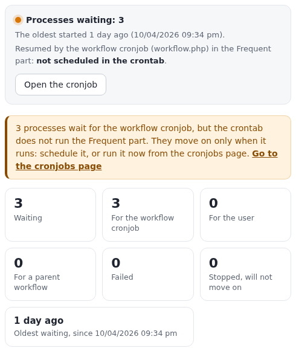
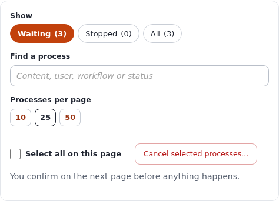
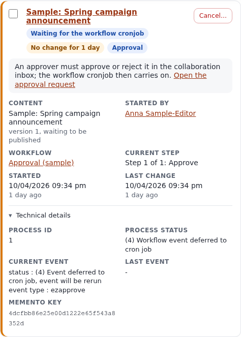
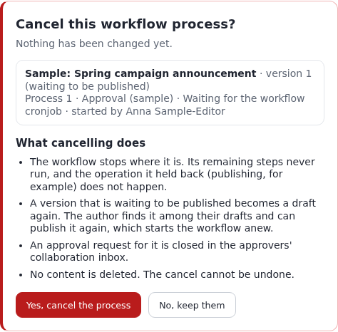

# Workflows: approvals, triggers and the processes that wait

This guide teaches how workflows work in Exponential and how to run them: what workflows, events and triggers are,
how to set up an approval before publishing with the collaboration inbox, what a workflow process is and which
states it goes through, every part of the workflow process list (Setup > Workflow processes), how the workflow
cronjob resumes waiting processes, how to cancel a stuck process safely, what the shell offers, and what to do when
a process does not move on.

It is written for administrators who set up editorial workflows and for operators who keep them running. Read
sections 1 and 4 first; after that every section stands on its own. Every field, status and behaviour below was
checked against the code (`kernel/classes/ezworkflowprocess.php`, `kernel/classes/eztrigger.php`,
`kernel/classes/workflowtypes/event/ezapprove/ezapprovetype.php`, `kernel/private/classes/cronjobs/workflow.php` and
`kernel/private/classes/views/workflow/processlist.php`), and the screenshots are of the demonstration server
(alpha.se7enx.com) on 5 October 2026, with the sample approvals of `exp:collaborationsampledata` waiting. Nothing was
cancelled or resumed to make them.

[Guides](README.md) · Related guide: [Cronjobs](cronjobs.md) · Feature reference:
[The cronjobs console](../features/6.0/cronjobs-console.md)

## In short

- A **workflow** is a list of steps (**events**: approve, wait until a date, multiplexer, payment ...). A
  **trigger** connects a workflow to an operation, before or after it runs: "before publishing content, run the
  approval workflow".
- When the operation runs, a **workflow process** starts for that one piece of content. A step that cannot finish
  at once (an approval nobody has decided yet) makes the process wait, and the operation waits with it: the version
  is "waiting to be published" (pending).
- The **workflow cronjob** (`workflow.php`, in the *frequent* part by default) runs every waiting process again.
  When the last step is done it carries out the held-back operation, for example publishes the version, and removes
  the process. Without that cronjob, approved content is never published.
- **Setup > Workflow processes** (`/workflow/processlist`) shows every waiting process: what it waits for in words,
  the content and version, who started it, the workflow and step, when it started and last changed, grouped by the
  trigger. A status bar says whether the workflow cronjob is scheduled and when it runs next.
- **Cancel...** on a process asks first and says what will happen; confirmed, the workflow stops, a pending version
  becomes a draft again, an approval request is closed and the process is removed. No content is deleted.
- An empty list is normal: a process exists only while a workflow waits.

## Contents

- [1. Workflows, events, triggers and processes](#1-workflows-events-triggers-and-processes)
- [2. Before you start](#2-before-you-start)
- [3. Worked example: approval before publishing](#3-worked-example-approval-before-publishing)
- [4. What a workflow process is, and its states](#4-what-a-workflow-process-is-and-its-states)
- [5. The workflow process list page](#5-the-workflow-process-list-page)
- [6. The workflow cronjob: how processes resume](#6-the-workflow-cronjob-how-processes-resume)
- [7. Cancelling and cleaning up processes safely](#7-cancelling-and-cleaning-up-processes-safely)
- [8. From the shell](#8-from-the-shell)
- [9. Troubleshooting](#9-troubleshooting)
- [10. Worked examples](#10-worked-examples)
- [References](#references)

## 1. Workflows, events, triggers and processes

| Term | What it is | Where you see it |
|---|---|---|
| Workflow | A named, ordered list of events, kept in a workflow group | Setup > Workflows (`/workflow/grouplist`) |
| Event | One step of a workflow, of an event type: *Approve*, *Wait until date*, *Multiplexer*, *Payment gateway*, *Simple shipping*, *Finish user register*, and those extensions add | The workflow's edit page |
| Trigger | The link between a workflow and an operation: module, operation, and *before* or *after* it. Its internal name is `pre_<operation>` or `post_<operation>` | Setup > Triggers (`/trigger/list`) |
| Workflow process | One run of a workflow for one piece of content (one object and version, one user) that has not finished | Setup > Workflow processes (`/workflow/processlist`) |
| Memento | What the kernel saved of the held-back operation so it can carry it out later: the module, the operation, the trigger name and its parameters (object id, version) | The process card's technical details |
| Collaboration item | The approval request an *Approve* step creates; approvers decide in their collaboration inbox | My account > Collaboration (`/collaboration/view/summary`) |

The flow, for an approval before publishing:

1. An editor presses **Send for publishing**. The `content/publish` operation starts and first marks the version
   *pending*.
2. The trigger `content/publish/before` finds the approval workflow and starts a process for this object and
   version.
3. The *Approve* event creates a collaboration item for the approvers and answers "run me again later". The
   process is now *waiting for the workflow cronjob*; the publish operation stops there. The editor sees that the
   version waits for approval.
4. An approver opens the request and presses **Approve** (or **Deny**).
5. The next time the workflow cronjob runs, the *Approve* event sees the decision. Approved: the process is done
   and the cronjob carries out the rest of the publish operation, so the version is published. Denied: the version
   goes back to the author as a draft and the process is cancelled and removed.

## 2. Before you start

- An administrator account, or a role with the `workflow` module (the workflow pages and the process list), the
  `trigger` module (triggers) and `setup/managecronjobs` (the cronjobs page).
- The workflow cronjob must run. Open Setup > Cronjobs ([the guide](cronjobs.md)) and look for `workflow.php`: it
  is in the *Frequent* part by default (`settings/cronjob.ini`, `[CronjobPart-frequent]`), which the suggested
  crontab runs every 5 minutes. The process list says it too, at the top (section 5.2).
- To try workflows without touching real content, the collaboration sample data builds an approval workflow, three
  sample editors, three pending articles and their approval requests (section 3.6).

## 3. Worked example: approval before publishing

The goal: every article an editor of the group *Editors* publishes in the *Standard* section waits until a member
of the group *Chief editors* approves it.

### 3.1 Create the workflow

1. Setup > Workflows. Open a workflow group (for example *Standard*), or create one with **New workflow group**.
2. **New workflow**. Name it, for example *Approval before publishing*.
3. Under the events, choose **Event / Approve** in the list and press **Add event**.

### 3.2 Set up the Approve event

The *Approve* event's form has these fields. Each one narrows who and what needs approval; content outside them is
let through at once (the event answers *accepted*).

| Field | What it does |
|---|---|
| Affected sections | Only content in these sections needs approval (*All sections* for every one). Content whose own section is not listed also counts when the parent of one of its locations is in a listed section. |
| Affected languages | Only versions whose initial language is one of these (*All languages* for every one). |
| Affected versions | *All versions*, only *Publishing new object* (version 1), or only *Updating existing object* (version 2 and later). |
| Users who approve content | Individual approvers. |
| Groups who approve content | Every user in these groups is an approver. |
| Excluded user groups | Users in these groups publish without approval. |

An approver never needs their own content approved: when the publishing user is one of the approvers, the event lets
the version through. Press **OK** to store the workflow.

### 3.3 Connect it with a trigger

Setup > Triggers lists every operation that can start a workflow, with the connection type *before* or *after*.
In the row **content / publish / before**, choose *Approval before publishing* and press **Apply changes**. One
workflow per trigger: to run several, put a *Multiplexer* event in the triggered workflow.

*Before* holds the operation back until the workflow is done; *after* runs the workflow once the operation has
happened (useful for notifications, not for approvals).

### 3.4 Make sure the workflow cronjob runs

Open Setup > Workflow processes. The status bar says, for example, "Resumed by the workflow cronjob (workflow.php) in
the Frequent part: **Every 5 minutes**, next run 10/05/2026 10:05 pm." If it says **not scheduled in the crontab**,
install the line the cronjobs page suggests (see [Cronjobs, section 12](cronjobs.md#12-scheduling-with-the-crontab)), or the approved articles will
wait for ever.

### 3.5 Try it

1. Log in as an editor (not an approver) and publish an article in an affected section. The article is not
   published; its version waits for approval.
2. Setup > Workflow processes now lists one process under **Before publishing content**: "Waiting for the workflow
   cronjob", with the line "An approver must approve or reject it in the collaboration inbox; the workflow cronjob
   then carries on." and a link **Open the approval request**.
3. Log in as an approver. My account > Collaboration lists the request. Open it, look at the preview and press
   **Approve** (or **Deny**, with a comment for the author).
4. Wait for the workflow cronjob, or run the Frequent part now from the cronjobs page. Approved: the article is
   published and the process is gone from the list. Denied: the version is a draft for the author again and the
   process is gone as well.

### 3.6 The sample approvals

```bash
./console exp:collaborationsampledata --dry-run --allow-root-user   # what it would create; nothing is written
./console exp:collaborationsampledata --allow-root-user             # create it
./console exp:collaborationsampledata --remove --allow-root-user    # remove all of it again
```

It creates the workflow *Approval (sample)* on `content/publish/before`, sample editors and approvers, articles
waiting for approval and their collaboration items, so the process list shows three waiting processes. `--remove`
also removes the sample workflow's processes, its trigger and the workflow itself.

## 4. What a workflow process is, and its states

A process is one row of `ezworkflow_process`. It holds the workflow, the user who started it, the parameters of the
operation (for `content/publish`: `object_id` and `version`), the event it is at (`event_id`, `event_position`,
counted from 1), the status of the last event that ran, the time it was created and last changed, and the
`memento_key` that names the saved operation.

### 4.1 Process statuses

The page groups the process statuses as **Waiting** (they will move on) and **Stopped** (nothing will run them
again). The number is the value stored in `ezworkflow_process.status`.

| No. | Status on the page | Group | What moves it on |
|---|---|---|---|
| 4 | Waiting for the workflow cronjob | Waiting | The workflow cronjob, at every run |
| 6, 10 | Waiting for the user | Waiting | The user answering the page an event showed them (the same request continues the workflow) |
| 7 | Waiting for the user to come back | Waiting | The user returning from where an event sent them, a payment provider for example |
| 9 | Waiting for its parent workflow | Waiting | The parent process whose *Multiplexer* event started it |
| 3 | Failed | Stopped | Nothing. An event rejected the content or went wrong |
| 1 | Marked as running | Stopped | Nothing. True only while a request or the cronjob runs it; hours later the run was cut off |
| 5 | Cancelled | Stopped | The workflow cronjob removes it when it meets it |
| 8 | Reset | Stopped | Nothing |
| 2 | Done | Stopped | Removed straight away when the operation finishes |
| 0 | Not started | Stopped | Nothing |

### 4.2 Event statuses

Each event answers with a status when it runs; the process stores the answer and the page shows it in the technical
details with its number (`eZWorkflowType::STATUS_*`).

| No. | Event status | What the process does next |
|---|---|---|
| 1 | Accepted event | Goes on to the next event; after the last one the process is done |
| 2 | Rejected event | Fails (process status 3) |
| 3, 4 | Event deferred to cron job (4: the event will be rerun) | Waits for the workflow cronjob (process status 4) |
| 5 | Event runs a sub event | Waits for its child processes (multiplexer) |
| 6 | Canceled whole workflow | Cancelled (process status 5) |
| 7, 8 | Event shows a page to the user | Waits for the user (6, 10) |
| 9 | Workflow done | Done (2) |
| 10, 11 | Event redirects the user | Waits for the user to come back (7) |
| 12 | Workflow was reset for reuse | Reset (8) |

### 4.3 Mementos

When an operation is held back, the kernel stores two mementos under the process's `memento_key` in
`ezoperation_memento`: the *child* memento names the module, the operation and the trigger (`content`, `publish`,
`pre_publish`) with the operation's parameters; the *main* memento belongs to the request that started it. The page
reads the child memento to find the trigger a process belongs to. The cronjob reads it to carry the operation out
when the process is done. A process whose child memento is gone cannot be resumed by its operation; the page lists
it under **Trigger not recorded**.

### 4.4 Publishing the same version again

The process key is built from the operation's keys (for `content/publish`: the object, the version, the workflow and
the user). When a process with the same key exists and has failed, been cancelled, is marked running or has no
state, starting the operation again removes that process and **stops the operation once**; the next attempt starts a
new process. A waiting process with the same key is run again instead. This is why a failed approval process can make
"Send for publishing" seem to do nothing the first time: cancel the failed process from the list first (section 7).

## 5. The workflow process list page

### 5.1 Opening it

Setup > **Workflow processes**, or `/workflow/processlist` in the administration interface. The filters are part of
the address: `/workflow/processlist/(status)/stopped` and `/workflow/processlist/(status)/all`. Paging adds
`/(offset)/<n>` as before.



### 5.2 The status bar

The first box says what is waiting now and who will move it on:

- **Processes waiting: N** and "The oldest started *1 day* ago (*time*)", or **Nothing is waiting**. The dot is blue,
  or amber once the oldest waiting process is more than a day old.
- **Resumed by the workflow cronjob (workflow.php) in the *Frequent* part:** with the schedule in words and the next
  run, read from the installed crontab the same way the cronjobs page reads it; or **not scheduled in the crontab**.
- **Open the cronjob** leads to that part's card on the cronjobs page (`/setup/cronjobs#cronjob-part-frequent`),
  where it can be run at once.

When processes wait for the cronjob but the crontab does not run its part, an amber message says so and links to
the cronjobs page. When no part runs `workflow.php` at all, a red message says how to add it.

### 5.3 The overview

Seven figures, counted over every process in the database (not only the page you are on):

| Figure | Counts |
|---|---|
| Waiting | Every process of a waiting status (4, 6, 7, 9, 10) |
| For the workflow cronjob | Status 4 |
| For the user | Status 6, 7 and 10 |
| For a parent workflow | Status 9 |
| Failed | Status 3, in red when there are any |
| Stopped, will not move on | Every stopped status (0, 1, 2, 3, 5, 8), in red when there are more than the failed ones |
| Oldest waiting | How long ago the oldest waiting process started, and when |

### 5.4 Filters, search and page size



- **Show**: *Waiting* (the default, and all this page used to show), *Stopped* or *All*, each with its count. They are
  links, so they work without javascript and can be bookmarked. The *Waiting* list leaves out processes without a
  memento key, as the page always did, since nothing can resume them; *Stopped* and *All* list every process.
- **Find a process** narrows the cards on the page as you type: content name, version (`v3`), process (`#12`), user,
  workflow, status or step. It searches the current page only; the line below says how many match.
- **Processes per page**: 10, 25 or 50 (from `admininterface.ini [PaginationSettings]`); the choice is stored as
  your preference `admin_workflow_processlist_limit`, as before.
- **Select all on this page** ticks every card shown, and **Cancel selected processes...** asks for confirmation for
  the ticked ones (section 7).

### 5.5 The groups

The processes are grouped by the trigger that started them, with the trigger in words (*Before publishing content*),
its internal name (`content/publish/pre_publish`) and the number of processes. Processes whose trigger cannot be
found come last under **Trigger not recorded**, with a note on why.

### 5.6 A process card



| Part | Shows |
|---|---|
| Title | The content's name, linking to the version it runs for (`/content/versionview/<object>/<version>`); "Process N" when there is no content |
| Badges | The status in words; **No change for N days** when a process that is not finished has not changed for more than a day; **Approval** when an approval request belongs to it |
| The grey line | What it waits for, as a sentence to act on; for an approval, a link **Open the approval request** to its collaboration item |
| Content | The name, the version and its state (*waiting to be published* for a pending version), or "The object no longer exists." |
| Started by | The user, linking to their user page |
| Workflow | Its name, linking to the workflow (`/workflow/view/<id>`) |
| Current step | "Step 1 of 2: Approve" and the event's description |
| Started, Last change | Date and time, and how long ago |
| Technical details | Process ID, process status number and name, the current and the last event (status number and name, event type, description, information), and the memento key: everything the old table showed |
| Cancel... | Asks before cancelling this process (section 7) |

A card has a red edge when the process failed, an amber one when it waits for the user or has not changed for more
than a day.

### 5.7 When the list is empty

"No processes are waiting. That is normal: a process exists only while a workflow waits for someone or something,
and is removed when it finishes." When there are stopped processes, a link shows them. The *Stopped* filter says
"Nothing has failed or been left behind." when it is empty.

### 5.8 Without javascript, with the keyboard, in the old design

- Everything works without javascript: the filters are links, **Cancel...** and **Cancel selected processes...**
  submit the form, the technical details and *What the statuses mean* are `<details>` sections. Only the search and
  *Select all* need script, and they are hidden without it.
- Every checkbox and every **Cancel...** button carries the process number and the content's name for screen
  readers ("Cancel process 1 (Sample: Spring campaign announcement)..."). Text has at least 4.5:1 contrast in the light and
  dark admin4 modes, and the page works from 390 pixels wide.
- The same template serves the admin4 design and the older admin design.

## 6. The workflow cronjob: how processes resume

`cronjobs/workflow.php` (the code is in `kernel/private/classes/cronjobs/workflow.php`) does this at every run:

1. It fetches every process **waiting for the workflow cronjob** (status 4). Processes waiting for the user or for a
   parent are not touched.
2. For each one, in its own transaction, it runs the current event again (`eZWorkflowProcess::run()`), and the
   events after it as far as they get.
3. If the process is now **done**, it reads the child memento, carries out the rest of the held-back operation with
   the trigger skipped (for `content/publish`: the publishing itself) and removes the process.
4. If it **failed**, was **cancelled**, **reset**, is **busy** or has **no state**, it removes the process's
   mementos. A cancelled process is removed as well; the others stay, so you can see them under *Stopped*.
5. Anything else (still waiting) is stored and tried again next time.

Its output, unless the cronjob runs quietly, is a status list and a total, for example:

```text
Checking for workflow processes
Status list
Workflow event deferred to cron job(4): 3

0 out of 3 processes was finished
```

"Status list" counts the processes by the status they had after this run; "0 out of 3" means none finished. The
sample approvals above stay at status 4 until an approver decides.

**Where it is configured.** `settings/cronjob.ini`:

```ini
[CronjobPart-frequent]
Scripts[]=notification.php
Scripts[]=workflow.php
...
```

An extension or a siteaccess can move it to another part; the process list finds the part wherever it is, preferring
one the crontab runs.

**Running it now.** From the browser: Setup > Cronjobs, the *Frequent* card, **Run part**, or open the card's scripts
and run `workflow.php` alone. From a shell, see section 8 and [Cronjobs, section 13](cronjobs.md#13-running-cronjobs-from-the-shell).

## 7. Cancelling and cleaning up processes safely

### 7.1 When to cancel

- An approval that will never be decided (the approver has left, the article is obsolete).
- A process **waiting for the user** whose user is gone (a checkout abandoned at the payment provider, a page never
  answered).
- A **Failed** process: nothing runs it again, and it holds back the next publish of the same version once (section
  4.4).
- A process **marked as running** for hours: its run was cut off.
- Processes under **Trigger not recorded**: they cannot be resumed by their operation.

Do not cancel a process only because it is old: an approval can legitimately wait for days. Look at the grey line
and, for approvals, at the request in the collaboration inbox first.

### 7.2 What cancelling does

Press **Cancel...** on a card, or tick several and press **Cancel selected processes...**. Nothing has happened yet:
a page lists the processes and says what cancelling does.



Press **Yes, cancel the process** to go ahead or **No, keep them** to go back. Confirmed, for each process, in one
transaction:

1. If its version is still *pending* (waiting to be published), it becomes a **draft** again, as a denied approval
   leaves it. The author finds it among their drafts and can publish it again, which starts the workflow anew.
2. If an approval request belongs to it, the request is set inactive, so it leaves the approvers' inbox, and its link
   to the process (`ezapprove_items`) is removed.
3. Its mementos are removed, then the process itself (`eZWorkflowProcess::removeThis()`, which also runs the cleanup
   of events that asked for it).

Nothing is published and no content is deleted. The list comes back with one message per process, for example
"Process 12 was cancelled. Version 3 of object 77 is a draft again; nothing was published." A process that finished
in the meantime is reported as no longer existing. A cancel cannot be undone; the way back is publishing the draft
again.

### 7.3 What it does not do

- It does not cancel the *child* processes a multiplexer started (status 9); cancel those too.
- It does not undo what earlier events already did (a mail already sent, a payment already taken).
- It does not change a version that is not pending (a published or archived one stays as it is).

## 8. From the shell

There is no console command that lists or cancels processes; the page is the tool for that. The shell is for running
the cronjob and for the sample data:

```bash
# run the whole part that holds workflow.php, for the site's siteaccess
php runcronjobs.php -s <siteaccess> frequent

# run only the workflow cronjob
php runcronjobs.php -s <siteaccess> --script=workflow.php

# the sample approvals: show, create, remove
./console exp:collaborationsampledata --dry-run --allow-root-user
./console exp:collaborationsampledata --allow-root-user
./console exp:collaborationsampledata --remove --allow-root-user
```

The cronjobs page shows each of these commands with your installation's path and PHP, with a **Copy** button. Run
the cronjob as the user the web server runs as, so that the files it writes stay writable for the site.

To look at the processes from a database client, read-only:

```sql
SELECT id, workflow_id, status, event_position, event_status, user_id, created, modified, memento_key
  FROM ezworkflow_process
 ORDER BY created;
```

`./console exp:flatten workflow` removes *temporary workflows* (unsaved workflow edits), not processes.

## 9. Troubleshooting

| Symptom | Cause | What to do |
|---|---|---|
| Approved articles are not published | The workflow cronjob does not run: the status bar says *not scheduled in the crontab*, or no part runs `workflow.php` | Install the crontab line for the part (cronjobs page), or run the part now. The article is published at the next run. |
| A process waits for the cronjob for days, the cronjob runs | Nobody has decided the approval; or no approver exists (empty approver groups) | Open the approval request from the card. If nobody can approve, add approvers to the event; a request already made keeps its participants, so cancel the process and send the content for publishing again. |
| A process *Waiting for the user* never moves | The user left the page or the payment provider | Cancel it once you are sure the user will not come back. |
| *Failed* processes pile up | An event rejected the content, or the object, its version or a parent location was missing when the cronjob ran (an *Approve* event then cancels) | Read the technical details for the event; cancel the process. |
| "Send for publishing" did nothing once, then worked | A failed or cancelled process with the same key was removed by the first attempt (section 4.4) | Cancel failed processes from the list first. |
| A process is *Marked as running* | A request or cronjob run died while running it | Cancel it; check the PHP error log for the run that died. |
| Pending content, but the waiting list is empty | The process has no memento key, or it has stopped | Look under *Stopped* and *All*. |
| Processes under *Trigger not recorded* | The child memento is gone, or the trigger was changed or removed since | They cannot be resumed by their operation: cancel them, then publish the content again. |
| The step says "None" and no step count | The process has not reached an event, or its workflow was deleted ("Workflow N (missing)") | Cancel it. |

## 10. Worked examples

### 10.1 Find out why an article is not published

1. Open Setup > Workflow processes and type the article's name in **Find a process**.
2. Its card says what it waits for. "An approver must approve or reject it" with **Open the approval request**:
   follow the link and see whether it has been decided.
3. Decided, but the process is still there: look at the status bar. *not scheduled in the crontab* means the
   cronjob never ran; **Open the cronjob** and **Run part**.
4. Reload the process list: the process is gone and the article is published.

### 10.2 Clean up after a removed approver

1. **Show: Waiting**, search for the workflow's name.
2. Tick the processes whose approval requests nobody can decide any more, then **Cancel selected processes...**.
3. Read the confirmation, press **Yes, cancel N processes**.
4. Tell the authors: their versions are drafts again and can be sent for publishing once the approval workflow names
   an approver who exists.

### 10.3 Check the workflow side of a fresh installation

1. Setup > Triggers: note which operations start a workflow.
2. Setup > Workflow processes: the status bar must name the part with `workflow.php` and say it is scheduled.
3. With `exp:collaborationsampledata`, three waiting processes appear; `--remove` takes them away again.

## References

- The page: `design/admin4/templates/workflow/processlist.tpl` (the same file in `design/admin`) and
  `kernel/private/classes/views/workflow/processlist.php`; tests `tests/tests/kernel/classes/eZWorkflowProcessListPageTest.php`
  (no database), `eZWorkflowProcessGroupingTest.php` and `eZWorkflowProcessListLiveTest.php`.
- Processes and triggers: `kernel/classes/ezworkflowprocess.php`, `kernel/classes/eztrigger.php`,
  `kernel/classes/ezworkflow.php`, `kernel/classes/ezworkflowtype.php`, `lib/ezutils/classes/ezoperationmemento.php`.
- The approval: `kernel/classes/workflowtypes/event/ezapprove/ezapprovetype.php` and
  `kernel/classes/collaborationhandlers/ezapprove/ezapprovecollaborationhandler.php`.
- The cronjob: `kernel/private/classes/cronjobs/workflow.php`, `settings/cronjob.ini`; the guide [Cronjobs](cronjobs.md)
  and the feature page [The cronjobs console](../features/6.0/cronjobs-console.md).
- Module views as classes: [Commands, cronjob parts and module views](../bc/6.0/cli_cronjob_view_abstractions.md).
